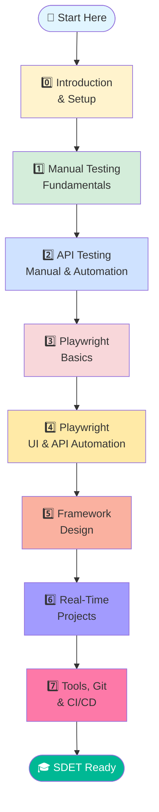
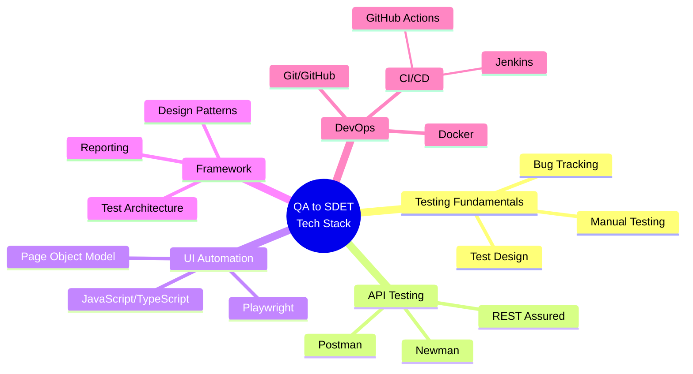
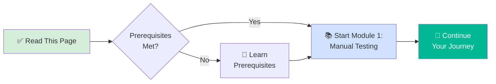

<div align="center">

# 🚀 QA to SDET Learning Roadmap


### Your Complete Journey from Manual Testing to Test Automation Engineer

*A structured, hands-on learning path for Manual Testing, API Testing, and Playwright Automation designed to take you from QA fundamentals to building enterprise-grade test automation frameworks.*

---

**[📖 Getting Started](#-getting-started)** • 
**[🧭 Roadmap](#-learning-roadmap)** • 
**[🛠️ Tools](#-tools--technologies)** • 
**[📚 Modules](#-course-modules)** • 
**[🎯 Prerequisites](#-prerequisites)**

---

</div>

## 📑 Table of Contents

- [Overview](#-overview)
- [Who Is This For?](#-who-is-this-for)
- [Learning Roadmap](#-learning-roadmap)
- [Skill Progression](#-skill-progression)
- [Course Modules](#-course-modules)
- [Tools & Technologies](#-tools--technologies)
- [Prerequisites](#-prerequisites)
- [Learning Objectives](#-learning-objectives)
- [How to Use This Repository](#-how-to-use-this-repository)
- [Getting Started](#-getting-started)
- [Best Practices](#-best-practices)
- [Contributing](#-contributing)
- [Support & Community](#-support--community)

---

## 🎯 Overview

This repository provides a **comprehensive, structured learning path** designed to transform you from a beginner in software testing to a proficient **Software Development Engineer in Test (SDET)**.

### What You'll Learn:

✅ **Manual Testing Fundamentals** - Core testing concepts, techniques, and methodologies  
✅ **API Testing** - Manual testing with Postman and automation with REST Assured  
✅ **Playwright Automation** - Modern web automation framework for UI and API testing  
✅ **Framework Design** - Build scalable, maintainable test automation frameworks  
✅ **Real-World Projects** - Apply skills to practical, industry-relevant scenarios  
✅ **DevOps Integration** - CI/CD pipelines, version control, and deployment automation  

> [!IMPORTANT]
> This is a **hands-on, project-based** learning path. Each module includes practical exercises, real-world examples, and projects you can add to your portfolio.

---

## 👥 Who Is This For?

This roadmap is designed for:

| Profile | What You'll Gain |
|---------|------------------|
| 🌱 **Beginners in Software Testing** | Start from scratch with manual testing fundamentals and progress to automation |
| 🔄 **Manual Testers Transitioning to Automation** | Build automation skills on top of your testing expertise |
| 🎓 **QA Engineers Preparing for Real-World Projects** | Learn industry-standard tools, frameworks, and best practices |
| 💼 **Career Changers into QA/SDET** | Complete learning path from basics to advanced automation |
| 🚀 **Aspiring SDETs** | Master the skills needed for SDET roles in top tech companies |

---

## 🧭 Learning Roadmap



### 📊 Learning Path Overview:

Each module builds upon previous concepts, creating a **progressive learning experience**:

1. **Foundation** → Manual Testing & Core Concepts
2. **Expansion** → API Testing & Automation Basics
3. **Specialization** → Playwright UI & API Automation
4. **Mastery** → Framework Design & Architecture
5. **Application** → Real-World Projects & DevOps

> [!TIP]
> While modules are independent, following the numeric order ensures you have the necessary prerequisites for each advanced topic.

---

## 📈 Skill Progression

```mermaid
graph LR
    subgraph "Foundation (Weeks 1-3)"
        A1[Manual Testing<br/>Concepts] --> A2[Test Case<br/>Design]
        A2 --> A3[Bug<br/>Reporting]
    end
    
    subgraph "Intermediate (Weeks 4-8)"
        B1[API Testing<br/>Manual] --> B2[Postman<br/>Automation]
        B2 --> B3[REST Assured<br/>Framework]
    end
    
    subgraph "Advanced (Weeks 9-14)"
        C1[Playwright<br/>Basics] --> C2[UI Automation<br/>Patterns]
        C2 --> C3[API + UI<br/>Integration]
    end
    
    subgraph "Expert (Weeks 15-20)"
        D1[Framework<br/>Architecture] --> D2[Real Projects<br/>Implementation]
        D2 --> D3[CI/CD<br/>Integration]
    end
    
    A3 --> B1
    B3 --> C1
    C3 --> D1
    
    style A1 fill:#d4edda
    style B1 fill:#cfe2ff
    style C1 fill:#ffeaa7
    style D1 fill:#fab1a0
```



---

## 📚 Course Modules

### Module 0️⃣: Introduction & Setup
**Duration:** 1-2 days  
**Level:** Beginner

- Repository overview and structure
- Setting up development environment
- Installing required tools
- Understanding the learning path

**Key Deliverables:**
- ✅ Development environment configured
- ✅ All tools installed and verified
- ✅ GitHub repository cloned

---

### Module 1️⃣: Manual Testing Fundamentals
**Duration:** 2-3 weeks  
**Level:** Beginner

**Topics Covered:**
- Core testing concepts and terminology
- Types of testing (functional, regression, smoke, sanity)
- Black box testing techniques (EP, BVA, Decision Tables, State Transition)
- Test levels (unit, integration, system, acceptance)
- Defect lifecycle and bug reporting
- Severity vs Priority

**Hands-On Practice:**
- ✍️ Writing test scenarios and test cases
- 🧪 Applying black box techniques
- 🐞 Creating comprehensive bug reports
- 🔍 Performing exploratory testing

**Key Deliverables:**
- ✅ Test case documentation
- ✅ Bug report samples
- ✅ Exploratory testing notes

📂 **[Go to Module 1: Manual Testing →](../1_manual_testing/)**

---

### Module 2️⃣: API Testing (Manual & Automation)
**Duration:** 3-4 weeks  
**Level:** Beginner to Intermediate

**Topics Covered:**
- API fundamentals (REST, SOAP, GraphQL)
- HTTP methods and status codes
- Request/Response structure
- Postman for manual API testing
- REST Assured for automation
- API test framework design

**Hands-On Practice:**
- 🔌 Testing REST APIs with Postman
- 📝 Writing API test collections
- 🤖 Automating API tests with REST Assured
- 📊 API response validation and assertions

**Key Deliverables:**
- ✅ Postman collection with 20+ API tests
- ✅ REST Assured automation scripts
- ✅ API test framework

📂 **[Go to Module 2: API Testing →](../02-api-testing/)**

---

### Module 3️⃣: Playwright Basics
**Duration:** 2 weeks  
**Level:** Intermediate

**Topics Covered:**
- Playwright setup and configuration
- Locator strategies
- Basic interactions (click, type, select)
- Assertions and validations
- Page Object Model (POM) introduction

**Hands-On Practice:**
- 🎭 Writing first Playwright tests
- 🔍 Mastering locator strategies
- 📄 Implementing Page Object Model
- ✅ Creating reusable test utilities

**Key Deliverables:**
- ✅ Basic Playwright test suite
- ✅ Page Object classes
- ✅ Utility functions library

📂 **[Go to Module 3: Playwright Basics →](../3_playwright_basics/)**

---

### Module 4️⃣: Playwright UI & API Automation
**Duration:** 3-4 weeks  
**Level:** Intermediate to Advanced

**Topics Covered:**
- Advanced Playwright features
- UI automation patterns
- API automation with Playwright
- Combining UI and API tests
- Data-driven testing
- Cross-browser testing

**Hands-On Practice:**
- 🖥️ Building comprehensive UI test suites
- 🔌 API testing with Playwright
- 🔄 Integrating UI and API tests
- 📊 Implementing data-driven tests

**Key Deliverables:**
- ✅ Complete UI automation suite
- ✅ API automation with Playwright
- ✅ Hybrid UI + API test scenarios

📂 **[Go to Module 4: Playwright UI & API →](../4_playwright_ui_and_api_automation/)**

---

### Module 5️⃣: Framework Design
**Duration:** 3-4 weeks  
**Level:** Advanced

**Topics Covered:**
- Test framework architecture
- Design patterns in test automation
- Configuration management
- Test data management
- Reporting and logging
- Error handling and recovery

**Hands-On Practice:**
- 🏗️ Designing scalable framework architecture
- 🎨 Implementing design patterns
- 📊 Building custom reporting solutions
- 🔧 Creating framework utilities

**Key Deliverables:**
- ✅ Custom test automation framework
- ✅ Framework documentation
- ✅ Reusable component library

📂 **[Go to Module 5: Framework Design →](../5_framework_design/)**

---

### Module 6️⃣: Real-Time Projects
**Duration:** 4-6 weeks  
**Level:** Advanced

**Topics Covered:**
- E-commerce application testing
- Banking application automation
- SaaS platform testing
- Mobile-responsive testing
- Performance testing basics

**Hands-On Practice:**
- 🛒 E-commerce end-to-end automation
- 🏦 Banking workflow automation
- 📱 Responsive UI testing
- ⚡ Basic performance testing

**Key Deliverables:**
- ✅ Complete project test suites
- ✅ Test execution reports
- ✅ Portfolio-ready projects

📂 **[Go to Module 6: Real-Time Projects →](../6_real_time_projects/)**

---

### Module 7️⃣: Tools, Git & CI/CD
**Duration:** 2-3 weeks  
**Level:** Intermediate to Advanced

**Topics Covered:**
- Version control with Git & GitHub
- CI/CD concepts and tools
- GitHub Actions for test automation
- Jenkins integration
- Docker for test environments
- Test execution in CI/CD pipelines

**Hands-On Practice:**
- 🔀 Git workflow management
- 🤖 Setting up GitHub Actions
- 🔄 Jenkins pipeline configuration
- 🐳 Docker test containers

**Key Deliverables:**
- ✅ GitHub Actions workflows
- ✅ Jenkins CI/CD pipeline
- ✅ Dockerized test environment

📂 **[Go to Module 7: Tools, Git & CI/CD →](../7_tools_git_cicd/)**

---

## 🛠️ Tools & Technologies

### Technology Stack Overview



### 🔧 Required Tools:

| Category | Tools | Purpose |
|----------|-------|---------|
| **Programming** | JavaScript / TypeScript | Test scripting and automation |
| **Manual Testing** | Test case management tools | Documentation and tracking |
| **API Testing** | Postman, REST Assured, Newman | API testing and automation |
| **UI Automation** | Playwright | Web application automation |
| **Version Control** | Git, GitHub | Source code management |
| **CI/CD** | GitHub Actions, Jenkins | Continuous integration/deployment |
| **Containerization** | Docker | Test environment isolation |
| **Reporting** | Allure, Playwright Reporter | Test execution reporting |
| **IDE** | VS Code, WebStorm, IntelliJ | Code development |

### 📦 Installation Guide:

Detailed installation instructions for each tool are provided in the respective module folders.

> [!NOTE]
> All tools used in this course are **free and open-source** or have free tiers suitable for learning.

---

## 🎓 Prerequisites

### Minimum Requirements:

#### For Manual Testing (Modules 0-1):
- ✅ **No prior experience required**
- ✅ Basic computer skills
- ✅ Willingness to learn

#### For API Testing (Module 2):
- ✅ Completed Module 1 (Manual Testing)
- ✅ Basic understanding of HTTP
- ✅ Familiarity with JSON format

#### For Automation (Modules 3-7):
- ✅ Completed Modules 1-2
- ✅ **Basic JavaScript/TypeScript** (or willingness to learn)
- ✅ Understanding of programming fundamentals (variables, functions, loops)
- ✅ Familiarity with command line/terminal

### Recommended (But Not Required):

- 📚 Basic understanding of HTML/CSS
- 🌐 Experience with web browsers and developer tools
- 💻 Familiarity with any programming language
- 🔧 Experience with version control (Git)

> [!TIP]
> If you're new to programming, consider taking a JavaScript basics course before starting Module 3. We recommend [freeCodeCamp's JavaScript course](https://www.freecodecamp.org/learn/javascript-algorithms-and-data-structures/).

---

## 🎯 Learning Objectives

By completing this roadmap, you will be able to:

### 🧠 Knowledge & Understanding:

- ✅ Understand software testing lifecycle and methodologies
- ✅ Explain different types and levels of testing
- ✅ Describe API testing concepts and protocols
- ✅ Understand test automation frameworks and design patterns
- ✅ Explain CI/CD pipelines and DevOps practices

### 🛠️ Practical Skills:

- ✅ Write comprehensive test cases and bug reports
- ✅ Perform manual API testing using Postman
- ✅ Automate API tests using REST Assured
- ✅ Build UI automation tests with Playwright
- ✅ Design and implement test automation frameworks
- ✅ Integrate tests into CI/CD pipelines
- ✅ Use Git for version control
- ✅ Create professional test documentation

### 💼 Career Readiness:

- ✅ Portfolio of real-world automation projects
- ✅ Industry-standard tools and frameworks
- ✅ Best practices for test automation
- ✅ Problem-solving and debugging skills
- ✅ Collaboration using Git/GitHub

---

## 📖 How to Use This Repository

### Step-by-Step Guide:

#### 1. **Start with Module 0** (This folder)
   - Read this README thoroughly
   - Set up your development environment
   - Install required tools

#### 2. **Follow Modules in Numeric Order**
   ```
   0_introduction → 1_manual_testing → 2_api_testing → 
   3_playwright_basics → 4_playwright_ui_api → 
   5_framework_design → 6_real_time_projects → 7_tools_git_cicd
   ```

#### 3. **For Each Module:**
   - 📖 Read the module README file
   - 📝 Study the concepts and examples
   - 💻 Complete hands-on exercises
   - 🧪 Practice with provided projects
   - ✅ Check your understanding with assessments

#### 4. **Track Your Progress:**
   - ⭐ Star this repository
   - 🍴 Fork to your GitHub account
   - ✍️ Document your learning journey
   - 📊 Update your portfolio

#### 5. **Build Your Portfolio:**
   - Create your own test projects
   - Push code to GitHub
   - Write clear README files
   - Document test results

> [!TIP]
> Create a dedicated branch for your work to keep your solutions separate from the original repository.

---

## 🚀 Getting Started

### Quick Start (5 Minutes):

```bash
# 1. Clone the repository
git clone https://github.com/ghanendra-sdet/qa-to-sdet-roadmap.git

# 2. Navigate to the project
cd qa-to-sdet-roadmap

# 3. Explore the structure
ls -la

# 4. Start with Module 1
cd 1_manual_testing

# 5. Read the README
cat README.md
```

### Development Environment Setup:

#### Option 1: Local Setup (Recommended)

1. **Install Node.js** (v18 or higher)
   - Download from [nodejs.org](https://nodejs.org/)
   - Verify: `node --version`

2. **Install Git**
   - Download from [git-scm.com](https://git-scm.com/)
   - Verify: `git --version`

3. **Install VS Code** (or your preferred IDE)
   - Download from [code.visualstudio.com](https://code.visualstudio.com/)

4. **Install Postman**
   - Download from [postman.com](https://www.postman.com/downloads/)

#### Option 2: Online Platform

For quick experimentation without local setup:
- [GitHub Codespaces](https://github.com/features/codespaces) - Cloud development environment
- [GitPod](https://www.gitpod.io/) - Browser-based IDE

---

## 💡 Best Practices

### While Learning:

✅ **DO:**
- ✔️ Practice consistently (30-60 minutes daily is better than 8 hours once a week)
- ✔️ Write code alongside tutorials (don't just read)
- ✔️ Document your learning and create notes
- ✔️ Ask questions in community forums
- ✔️ Build projects to solidify understanding
- ✔️ Push code to GitHub regularly
- ✔️ Review and refactor your code

❌ **DON'T:**
- ✖️ Skip manual testing fundamentals
- ✖️ Rush through exercises without understanding
- ✖️ Copy-paste code without comprehension
- ✖️ Skip error messages—read and understand them
- ✖️ Work in isolation—join communities and collaborate
- ✖️ Aim for perfection—focus on progress

### Code Quality:

- 📝 Write clean, readable code
- 💬 Add meaningful comments
- 🏗️ Follow consistent naming conventions
- 🧪 Write modular, reusable functions
- 📚 Create comprehensive documentation

---

## 🤝 Contributing

We welcome contributions to improve this learning resource!

### How to Contribute:

1. 🍴 **Fork** this repository
2. 🌿 **Create a branch** for your contribution
   ```bash
   git checkout -b feature/improve-documentation
   ```
3. ✏️ **Make your changes**
   - Fix typos or errors
   - Add new examples
   - Improve explanations
   - Share real-world scenarios
4. 📝 **Commit with clear messages**
   ```bash
   git commit -m "docs: improve API testing examples"
   ```
5. 🚀 **Push and create Pull Request**
   ```bash
   git push origin feature/improve-documentation
   ```

### Contribution Ideas:

- 📖 Improve documentation clarity
- 🧪 Add more practice exercises
- 💡 Share real-world examples
- 🎥 Create video tutorials
- 🌍 Translate to other languages
- 🐛 Report and fix bugs

---

## 💬 Support & Community

### Get Help:

- 📖 **Documentation:** Each module has detailed README files
- 💬 **Discussions:** Use GitHub Discussions for questions
- 🐛 **Issues:** Report bugs or request features via GitHub Issues

### Stay Connected:

- ⭐ **Star** this repository to stay updated
- 👀 **Watch** for new releases and updates
- 🍴 **Fork** to create your own version

### Recommended Communities:

- [Ministry of Testing](https://www.ministryoftesting.com/) - Testing community
- [Test Automation University](https://testautomationu.applitools.com/) - Free courses
- [Playwright Discord](https://discord.com/invite/playwright) - Playwright community
- [r/softwaretesting](https://www.reddit.com/r/softwaretesting/) - Reddit community

---

## 📊 Learning Metrics

### Time Commitment:

| Learning Pace | Weekly Hours | Total Duration |
|---------------|--------------|----------------|
| **Part-time** | 5-10 hours | 4-6 months |
| **Accelerated** | 15-20 hours | 2-3 months |
| **Full-time** | 30-40 hours | 1-1.5 months |

> [!NOTE]
> These are estimates. Your actual timeline may vary based on prior experience and learning speed.

---

## 🎓 Next Steps

### Ready to Begin?



### Your Action Plan:

1. ⭐ **Star this repository** to bookmark it
2. 🍴 **Fork** to create your own copy
3. 📖 **Read** [Module 1: Manual Testing](../1_manual_testing/)
4. 💻 **Set up** your development environment
5. ✍️ **Start** with your first exercise

---

## 📄 Version History

| Version | Date | Changes |
|---------|------|---------|
| 2.0 | 2026-02-10 | Major enhancement: Added badges, comprehensive TOC, 3 Mermaid diagrams (roadmap, skill progression, tech stack), detailed module breakdowns with time estimates, prerequisites, learning objectives, getting started guide, best practices, contribution guidelines |
| 1.0 | 2025-11-01 | Initial roadmap structure |

---

<div align="center">

## 🌟 Ready to Start Your SDET Journey?

**Your transformation from QA to SDET begins with a single test case.**

---

### 📚 **[Begin with Module 1: Manual Testing →](../1_manual_testing/)**

---

Made with ❤️ for aspiring QA Engineers and SDETs

**Happy Learning! 🚀**

*Last Updated: February 2026*

**[⬆ Back to Top](#-qa-to-sdet-learning-roadmap)**

</div>
