# 🎯 Learning Objectives

**Master the complete skillset required to become a Software Development Engineer in Test (SDET)**

---

## 📑 Table of Contents

- [Overview](#-overview)
- [Skill Progression Map](#-skill-progression-map)
- [Core Learning Areas](#-core-learning-areas)
  - [Manual Testing](#-manual-testing)
  - [API Testing](#-api-testing)
  - [Playwright Automation](#-playwright-automation)
  - [Framework Design](#-framework-design)
  - [Career Readiness](#-career-readiness)
- [Proficiency Levels](#-proficiency-levels)
- [Timeline & Milestones](#-timeline--milestones)
- [Career Outcomes](#-career-outcomes)
- [How to Use This Document](#-how-to-use-this-document)

---

## 🎓 Overview

By completing this comprehensive QA to SDET roadmap, you will acquire a complete set of skills spanning **manual testing foundations** to **advanced test automation engineering**. This document outlines specific, measurable learning objectives for each skill area.

> [!IMPORTANT]
> These objectives are designed to be **portfolio-worthy** and **interview-ready**. Each skill you master here directly translates to real-world job requirements for QA and SDET roles.

---

## 🗺️ Skill Progression Map

```mermaid
graph TB
    subgraph Foundation["🌱 Foundation (Weeks 1-3)"]
        A1[Manual Testing<br/>Concepts] --> A2[Test Case<br/>Design]
        A2 --> A3[Bug Reporting<br/>& Tracking]
    end
    
    subgraph Intermediate["🔧 Intermediate (Weeks 4-8)"]
        B1[API Testing<br/>Fundamentals] --> B2[Postman<br/>Automation]
        B2 --> B3[REST Assured<br/>Framework]
    end
    
    subgraph Advanced["⚡ Advanced (Weeks 9-14)"]
        C1[Playwright<br/>Basics] --> C2[UI Automation<br/>Patterns]
        C2 --> C3[API + UI<br/>Integration]
    end
    
    subgraph Expert["🏆 Expert (Weeks 15-20)"]
        D1[Framework<br/>Architecture] --> D2[Design<br/>Patterns]
        D2 --> D3[CI/CD &<br/>DevOps]
    end
    
    A3 --> B1
    B3 --> C1
    C3 --> D1
    D3 --> E[🎓 SDET Ready]
    
    style A1 fill:#d4edda
    style B1 fill:#cfe2ff
    style C1 fill:#fff3cd
    style D1 fill:#ffd6e7
    style E fill:#00b894,color:#fff
```

---

## 🎯 Core Learning Areas

### 🧠 Manual Testing

**Target Proficiency:** Intermediate to Advanced

#### Knowledge Objectives:
- ✅ **Understand SDLC & STLC** 
  - Explain all phases of Software Development Life Cycle
  - Describe Software Testing Life Cycle in detail
  - Identify appropriate testing activities for each SDLC phase
  - Understand Agile, Waterfall, and V-Model methodologies

- ✅ **Master Testing Fundamentals**
  - Define and differentiate: Functional, Non-functional, Regression, Smoke, Sanity, Exploratory testing
  - Explain test levels: Unit, Integration, System, Acceptance testing
  - Understand test design techniques: Equivalence Partitioning, Boundary Value Analysis, Decision Tables, State Transition

- ✅ **Defect Management**
  - Understand complete defect lifecycle
  - Differentiate between Severity vs Priority
  - Know when and how to escalate defects

#### Practical Skills:
- ✅ **Write Comprehensive Test Cases**
  - Create test scenarios from requirements
  - Write detailed, reusable test cases
  - Apply black box testing techniques
  - Design data-driven test cases
  - Maintain test case documentation

- ✅ **Perform Effective Testing**
  - Execute functional testing systematically
  - Conduct regression testing efficiently
  - Perform exploratory testing with session notes
  - Validate UI/UX requirements
  - Test edge cases and boundary conditions

- ✅ **Create Professional Bug Reports**
  - Write clear, reproducible bug reports
  - Include proper evidence (screenshots, logs, videos)
  - Assign appropriate severity and priority
  - Track defects through resolution
  - Communicate effectively with developers

**📂 Covered in:** [Module 01: Manual Testing](../01-manual-testing/)

---

### 🔗 API Testing

**Target Proficiency:** Advanced

#### Knowledge Objectives:
- ✅ **Understand REST APIs**
  - Explain RESTful architecture principles
  - Understand HTTP methods: GET, POST, PUT, PATCH, DELETE
  - Know HTTP status codes (2xx, 3xx, 4xx, 5xx)
  - Understand request/response structure
  - Explain authentication methods: Basic, Bearer Token, OAuth 2.0

- ✅ **Learn API Testing Concepts**
  - Understand API contract testing
  - Know how to validate JSON/XML responses
  - Understand API error handling
  - Learn about rate limiting and throttling
  - Grasp API versioning strategies

#### Practical Skills:
- ✅ **Test APIs Using Postman**
  - Create and organize Postman collections
  - Write API tests with assertions
  - Use environment variables and data files
  - Chain requests using collection variables
  - Generate API documentation
  - Export/import collections for team sharing

- ✅ **Automate APIs with Playwright**
  - Send HTTP requests using Playwright API context
  - Validate API responses programmatically
  - Handle authentication in automated tests
  - Implement data-driven API tests
  - Combine UI and API testing in single flows

- ✅ **Automate APIs with REST Assured** *(Optional)*
  - Write API test automation scripts
  - Implement request/response specifications
  - Validate JSON schemas
  - Handle complex authentication flows
  - Generate API test reports

**📂 Covered in:** [Module 02: API Testing](../02-api-testing/)

---

### 🎭 Playwright Automation

**Target Proficiency:** Advanced to Expert

#### Knowledge Objectives:
- ✅ **Understand Modern Web Automation**
  - Explain Playwright architecture
  - Understand browser context and pages
  - Know auto-waiting mechanisms
  - Understand headless vs headed mode
  - Learn about network interception

#### Practical Skills:
- ✅ **Set Up Playwright Projects**
  - Initialize Playwright in TypeScript/JavaScript
  - Configure playwright.config.ts
  - Set up multiple browsers (Chromium, Firefox, WebKit)
  - Configure test timeouts and retries
  - Organize test project structure

- ✅ **Write Effective UI Tests**
  - Use various locator strategies (CSS, XPath, Text, Role)
  - Implement best locator practices
  - Handle dynamic elements and waits
  - Manage iframes and shadow DOM
  - Test file uploads and downloads
  - Handle browser alerts and dialogs

- ✅ **Master Playwright Features**
  - Use fixtures for setup/teardown
  - Implement Page Object Model (POM)
  - Write reusable helper functions
  - Use assertions effectively
  - Handle multiple tabs/windows
  - Implement visual regression testing
  - Debug tests using Playwright Inspector

- ✅ **Write API Tests with Playwright**
  - Use APIRequestContext for API testing
  - Bypass UI for test data setup
  - Combine UI and API in E2E scenarios
  - Mock API responses
  - Intercept and modify network requests

- ✅ **Handle Real-World Challenges**
  - Test responsive/mobile layouts
  - Implement cross-browser testing
  - Handle authentication (cookies, localStorage, sessions)
  - Test SPAs (Single Page Applications)
  - Work with async operations
  - Implement screenshot and video recording
  - Handle flaky tests

**📂 Covered in:** [Module 03: Playwright Basics](../03-playwright-basics/) | [Module 04: Playwright Automation](../04-playwright-automation/)

---

### 🏗 Framework Design

**Target Proficiency:** Expert

#### Knowledge Objectives:
- ✅ **Understand Framework Architecture**
  - Explain different framework types (Data-Driven, Keyword-Driven, Hybrid, BDD)
  - Design scalable folder structures
  - Understand separation of concerns
  - Know configuration management best practices
  - Understand dependency injection

#### Practical Skills:
- ✅ **Design Scalable Automation Frameworks**
  - Create modular, maintainable framework architecture
  - Implement layered architecture (UI, Business Logic, Data, Utilities)
  - Design reusable components and utilities
  - Implement centralized configuration management
  - Create custom reporters and loggers

- ✅ **Apply Design Patterns**
  - Implement Page Object Model (POM)
  - Use Singleton pattern for driver management
  - Apply Factory pattern for object creation
  - Implement Strategy pattern for test execution
  - Use Builder pattern for complex object creation

- ✅ **Follow Best Practices**
  - Write clean, readable, maintainable code
  - Implement proper error handling and recovery
  - Use meaningful naming conventions
  - Write comprehensive code documentation
  - Implement data-driven testing
  - Create parameterized and dynamic tests
  - Implement parallel test execution
  - Manage test data effectively

**📂 Covered in:** [Module 05: Framework Design](../05-framework-design/)

---

### 🚀 Career Readiness

**Target Proficiency:** Industry Standard

#### Professional Skills:
- ✅ **Work on Real-World Projects**
  - Complete end-to-end e-commerce automation projects
  - Build banking application test suites
  - Automate SaaS platform workflows
  - Test responsive and mobile web applications
  - Handle complex business logic scenarios

- ✅ **Version Control Mastery**
  - Understand Git fundamentals (init, clone, commit, push, pull)
  - Work with branches and merging
  - Resolve merge conflicts
  - Use GitHub for collaboration
  - Follow Git best practices and commit conventions
  - Create meaningful pull requests
  - Perform code reviews

- ✅ **CI/CD Integration**
  - Understand CI/CD pipeline concepts
  - Set up GitHub Actions workflows
  - Configure Jenkins jobs *(optional)*
  - Integrate tests into deployment pipelines
  - Generate and publish test reports
  - Implement scheduled test execution
  - Set up notifications for test failures

- ✅ **Build Professional Portfolio**
  - Create portfolio-ready automation projects
  - Write comprehensive README files
  - Document framework architecture
  - Showcase test reports and metrics
  - Maintain clean Git history
  - Present projects professionally

**📂 Covered in:** [Module 08: Real-World Projects](../08-real-world-projects/) | [Module 09: Git, GitHub & CI/CD](../9_git_github_and_ci_cd/)

---

## 📊 Proficiency Levels

Track your expected proficiency for each skill area:

| Skill Area | Starting Level | Target Level | Modules |
|------------|---------------|--------------|---------|
| **Manual Testing** | 🌱 Beginner | ⭐⭐⭐ Advanced | 01 |
| **API Testing (Manual)** | 🌱 Beginner | ⭐⭐⭐ Advanced | 02 |
| **API Testing (Automation)** | 🌱 Beginner | ⭐⭐⭐⭐ Expert | 02, 04 |
| **Playwright UI Automation** | 🌱 Beginner | ⭐⭐⭐⭐ Expert | 03, 04 |
| **Framework Design** | 🌱 Beginner | ⭐⭐⭐⭐ Expert | 05 |
| **JavaScript/TypeScript** | 🌱 Beginner | ⭐⭐⭐ Advanced | All |
| **Git & Version Control** | 🌱 Beginner | ⭐⭐⭐ Advanced | 09 |
| **CI/CD** | 🌱 Beginner | ⭐⭐ Intermediate | 09 |

**Legend:**
- 🌱 Beginner: Basic understanding
- ⭐⭐ Intermediate: Can work independently with guidance
- ⭐⭐⭐ Advanced: Can work independently and solve complex problems
- ⭐⭐⭐⭐ Expert: Can design solutions and mentor others

---

## ⏱️ Timeline & Milestones

### Key Milestones:

| Week | Milestone | Skills Acquired |
|------|-----------|-----------------|
| **Week 3** | 🏆 Manual Testing Complete | Test case design, bug reporting, black box techniques |
| **Week 8** | 🏆 API Testing Complete | Postman, REST Assured, Playwright API automation |
| **Week 14** | 🏆 Playwright Mastery | UI automation, API automation, POM, advanced patterns |
| **Week 18** | 🏆 Framework Design Complete | Scalable frameworks, design patterns, best practices |
| **Week 24** | 🎓 **SDET Ready** | Portfolio projects, CI/CD, professional GitHub profile |

---

## 💼 Career Outcomes

Upon completion of this roadmap, you will be qualified for:

### Job Roles:
- ✅ **QA Engineer** (Entry to Mid-level)
- ✅ **Test Automation Engineer** (Mid-level)
- ✅ **SDET** (Software Development Engineer in Test)
- ✅ **QA Lead** (with additional experience)

### Salary Expectations (Global Averages):
| Role | Experience | Approximate Range (USD) |
|------|------------|------------------------|
| QA Engineer | 0-2 years | $50K - $70K |
| Automation Engineer | 2-4 years | $70K - $95K |
| SDET | 3-5 years | $90K - $130K |
| Senior SDET | 5+ years | $120K - $160K+ |

> [!NOTE]
> Salary ranges vary significantly by location, company size, and industry. These are approximate global averages for reference.

### Portfolio Highlights:
By the end of this roadmap, your portfolio will include:
- ✅ 5+ real-world automation projects
- ✅ Custom test automation framework
- ✅ Working CI/CD pipelines
- ✅ Comprehensive test documentation
- ✅ Active GitHub profile with 100+ commits
- ✅ API and UI test suites

---

## 📖 How to Use This Document

### As a Roadmap:
1. **Start at the top** - Begin with Manual Testing objectives
2. **Progress sequentially** - Each section builds on previous knowledge
3. **Track your progress** - Check off objectives as you master them
4. **Reference frequently** - Return to review what you should be learning

### As a Progress Tracker:
- Print or bookmark this document
- Check off each objective as you complete it
- Use it to identify knowledge gaps
- Review before interviews to assess readiness

### As an Interview Prep Guide:
- Review objectives for roles you're applying to
- Ensure you can demonstrate each skill practically
- Prepare examples from your projects for each objective
- Use as a checklist before SDET interviews

---

## 🎯 Ready to Start?

**Your SDET journey begins with a single objective. Let's achieve them all!**

### 📚 **[Begin with Module 00: Introduction →](./README.md)**

---

**[⬆ Back to Top](#-learning-objectives)**

*Last Updated: February 2026*

