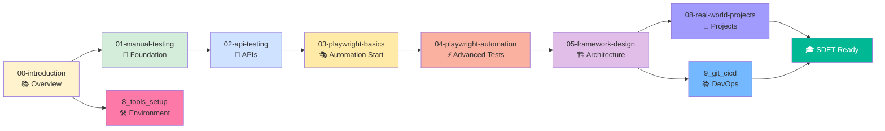
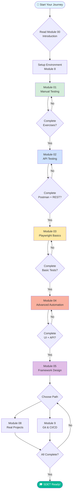

<div align="center">

# 📁 Repository Structure


**A well-organized, progressive learning structure designed for easy navigation and effective learning**

---

</div>

## 📑 Table of Contents

- [Overview](#-overview)
- [Visual Repository Map](#-visual-repository-map)
- [Directory Structure](#-directory-structure)
- [Module Guide](#-module-guide)
- [File Organization](#-file-organization)
- [Navigation Tips](#-navigation-tips)
- [Module Dependencies](#-module-dependencies)
- [Quick Reference](#-quick-reference)

---

## 🎯 Overview

This repository follows a **numbered, sequential structure** designed to guide you through a complete QA to SDET learning journey. Each module folder is prefixed with a number indicating the recommended learning order.

> [!TIP]
> The numeric prefixes (00, 01, 02, etc.) ensure folders are displayed in the correct learning sequence in file explorers and GitHub.

---

## 🗺️ Visual Repository Map

```mermaid
graph TB
    Root[📦 qa-to-sdet-roadmap]
    
    Root --> M00[00-introduction<br/>🏠 Start Here]
    Root --> M01[01-manual-testing<br/>🧪 Foundation]
    Root --> M02[02-api-testing<br/>🔌 Intermediate]
    Root --> M03[03-playwright-basics<br/>🎭 Automation Start]
    Root --> M04[04-playwright-automation<br/>⚡ Advanced Automation]
    Root --> M05[05-framework-design<br/>🏗️ Architecture]
    Root --> M08[08-real-world-projects<br/>🚀 Real Projects]
    Root --> Tools[8_tools_and_environment_setup<br/>🛠️ Dev Setup]
    Root --> Git[9_git_github_and_ci_cd<br/>📚 Version Control]
    Root --> Res[resources/<br/>📚 Learning Materials]
    
    M00 --> M00R[README.md<br/>learning_objectives.md<br/>repo_structure.md]
    M01 --> M01C[concepts/<br/>exercises/<br/>resources/]
    M02 --> M02F[Postman Collections<br/>REST Assured Examples]
    M03 --> M03F[Basic Tests<br/>Locators<br/>POM Intro]
    M04 --> M04F[UI Automation<br/>API Automation<br/>Hybrid Tests]
    M05 --> M05F[Framework Design<br/>Design Patterns<br/>Best Practices]
    M08 --> M08F[E-commerce Project<br/>Banking Project<br/>SaaS Project]
    Tools --> ToolsF[Installation Guides<br/>Setup Scripts<br/>Verification]
    Git --> GitF[Git Basics<br/>GitHub Workflows<br/>CI/CD Pipelines]
    Res --> ResC[cheatsheets/<br/>interview-prep/]
    
    style Root fill:#e1f5ff,stroke:#333,stroke-width:3px
    style M00 fill:#fff3cd
    style M01 fill:#d4edda
    style M02 fill:#cfe2ff
    style M03 fill:#ffeaa7
    style M04 fill:#fab1a0
    style M05 fill:#e1bee7
    style M08 fill:#a29bfe
    style Tools fill:#fd79a8
    style Git fill:#74b9ff
    style Res fill:#dfe6e9
```



---

## 📂 Directory Structure

### Complete Folder Tree:

```text
qa-to-sdet-roadmap/
│
├── 00-introduction/                    📍 START HERE
│   ├── README.md                       → Complete roadmap overview
│   ├── learning_objectives.md          → Detailed learning goals
│   └── repo_structure.md               → This file
│
├── 01-manual-testing/                  🧪 MANUAL TESTING (2-3 weeks)
│   ├── concepts/                       → Core testing concepts
│   ├── exercises/                      → Hands-on practice
│   ├── resources/                      → Additional materials
│   └── README.md                       → Module overview
│
├── 02-api-testing/                     🔌 API TESTING (3-4 weeks)
│   ├── postman/                        → Postman collections
│   ├── rest-assured/                   → REST Assured examples
│   ├── playwright-api/                 → Playwright API tests
│   └── README.md                       → Module overview
│
├── 03-playwright-basics/               🎭 PLAYWRIGHT BASICS (2 weeks)
│   ├── setup/                          → Installation & config
│   ├── locators/                       → Locator strategies
│   ├── basic-tests/                    → First tests
│   ├── page-objects/                   → POM introduction
│   └── README.md                       → Module overview
│
├── 04-playwright-automation/           ⚡ ADVANCED AUTOMATION (3-4 weeks)
│   ├── ui-automation/                  → UI test patterns
│   ├── api-automation/                 → API automation
│   ├── hybrid-tests/                   → UI + API combined
│   └── README.md                       → Module overview
│
├── 05-framework-design/                🏗️ FRAMEWORK DESIGN (3-4 weeks)
│   ├── architecture/                   → Framework structure
│   ├── design-patterns/                → Common patterns
│   ├── utilities/                      → Reusable utilities
│   └── README.md                       → Module overview
│
├── 08-real-world-projects/             🚀 REAL PROJECTS (4-6 weeks)
│   ├── ecommerce-automation/           → E-commerce project
│   ├── banking-automation/             → Banking project
│   ├── saas-automation/                → SaaS project
│   └── README.md                       → Module overview
│
├── 8_tools_and_environment_setup/      🛠️ DEV ENVIRONMENT (1 week)
│   ├── installation-guides/            → Tool installation
│   ├── configuration/                  → Setup configs
│   └── README.md                       → Module overview
│
├── 9_git_github_and_ci_cd/             📚 VERSION CONTROL (2-3 weeks)
│   ├── git-basics/                     → Git fundamentals
│   ├── github-workflows/               → GitHub Actions
│   ├── jenkins/                        → Jenkins CI/CD
│   └── README.md                       → Module overview
│
├── resources/                          📚 LEARNING RESOURCES
│   ├── cheatsheets/                    → Quick reference guides
│   │   ├── git-commands.md
│   │   ├── playwright-quick-reference.md
│   │   └── api-testing-reference.md
│   ├── interview-prep/                 → Interview materials
│   └── README.md                       → Resources overview
│
├── README.md                           📖 Main repository README
├── LICENSE                             📄 MIT License
└── verify-setup.js                     ✅ Environment verification script
```

---

## 📚 Module Guide

### Detailed Module Breakdown:

#### Module 00: Introduction & Setup
**📂 Directory:** `00-introduction/`  
**⏱️ Duration:** 1-2 days  
**📊 Difficulty:** ⭐ Beginner  
**🎯 Prerequisites:** None

**What's Inside:**
- Complete roadmap overview and learning path
- Detailed learning objectives for all modules
- Repository structure guide (this document)
- Getting started instructions

**Key Files:**
- `README.md` - Comprehensive introduction with Mermaid diagrams
- `learning_objectives.md` - Detailed learning goals
- `repo_structure.md` - Navigation guide

**Next Module:** → [01-manual-testing](../01-manual-testing/)

---

#### Module 01: Manual Testing Fundamentals
**📂 Directory:** `01-manual-testing/`  
**⏱️ Duration:** 2-3 weeks  
**📊 Difficulty:** ⭐ Beginner  
**🎯 Prerequisites:** Module 00 completed  
**📦 Sub-folders:** 3 (concepts, exercises, resources)

**What's Inside:**
- Core testing concepts and terminology
- Black box testing techniques (EP, BVA, Decision Tables, State Transition)
- Test case design and documentation
- Bug reporting and defect lifecycle
- Practical exercises and real-world examples

**Deliverables:**
- ✅ 50+ test cases written
- ✅ 20+ bug reports created
- ✅ Exploratory testing notes

**Dependencies:** None (foundation module)  
**Next Module:** → [02-api-testing](../02-api-testing/)

---

#### Module 02: API Testing (Manual & Automation)
**📂 Directory:** `02-api-testing/`  
**⏱️ Duration:** 3-4 weeks  
**📊 Difficulty:** ⭐⭐ Intermediate  
**🎯 Prerequisites:** Module 01 completed  
**📦 Sub-folders:** Multiple for different tools

**What's Inside:**
- API fundamentals (REST, SOAP, GraphQL)
- Manual API testing with Postman
- API automation with REST Assured
- API automation with Playwright
- API test framework design

**Deliverables:**
- ✅ Postman collection with 30+ API tests
- ✅ REST Assured automation suite
- ✅ Playwright API test framework

**Dependencies:** Manual Testing concepts  
**Next Module:** → [03-playwright-basics](../03-playwright-basics/)

---

#### Module 03: Playwright Basics
**📂 Directory:** `03-playwright-basics/`  
**⏱️ Duration:** 2 weeks  
**📊 Difficulty:** ⭐⭐ Intermediate  
**🎯 Prerequisites:** Modules 01-02 completed, Basic JavaScript  
**📦 Sub-folders:** 4 (setup, locators, basic-tests, page-objects)

**What's Inside:**
- Playwright installation and configuration
- Locator strategies and best practices
- Basic interactions and assertions
- Page Object Model introduction
- Debugging and troubleshooting

**Deliverables:**
- ✅ Configured Playwright project
- ✅ 20+ basic UI tests
- ✅ Page Object classes

**Dependencies:** API Testing, JavaScript basics  
**Next Module:** → [04-playwright-automation](../04-playwright-automation/)

---

#### Module 04: Playwright UI & API Automation
**📂 Directory:** `04-playwright-automation/`  
**⏱️ Duration:** 3-4 weeks  
**📊 Difficulty:** ⭐⭐⭐ Advanced  
**🎯 Prerequisites:** Module 03 completed  
**📦 Sub-folders:** 3 (ui-automation, api-automation, hybrid-tests)

**What's Inside:**
- Advanced UI automation patterns
- API automation with Playwright
- Combining UI and API tests
- Data-driven testing
- Cross-browser testing
- Visual regression testing

**Deliverables:**
- ✅ Complete UI test suite (50+ tests)
- ✅ API automation with Playwright
- ✅ Hybrid UI + API scenarios

**Dependencies:** Playwright Basics  
**Next Module:** → [05-framework-design](../05-framework-design/)

---

#### Module 05: Framework Design
**📂 Directory:** `05-framework-design/`  
**⏱️ Duration:** 3-4 weeks  
**📊 Difficulty:** ⭐⭐⭐⭐ Expert  
**🎯 Prerequisites:** Modules 01-04 completed  
**📦 Sub-folders:** 3 (architecture, design-patterns, utilities)

**What's Inside:**
- Test framework architecture
- Design patterns (Singleton, Factory, Builder, Strategy)
- Configuration management
- Test data management
- Reporting and logging frameworks
- Error handling strategies

**Deliverables:**
- ✅ Custom automation framework
- ✅ Framework documentation
- ✅ Reusable component library

**Dependencies:** All previous automation modules  
**Next Module:** → [08-real-world-projects](../08-real-world-projects/)

---

#### Module 08: Real-World Projects
**📂 Directory:** `08-real-world-projects/`  
**⏱️ Duration:** 4-6 weeks  
**📊 Difficulty:** ⭐⭐⭐⭐ Expert  
**🎯 Prerequisites:** Modules 01-05 completed  
**📦 Sub-folders:** 3 major projects

**What's Inside:**
- E-commerce application automation
- Banking workflow automation
- SaaS platform testing
- Mobile-responsive testing
- Performance testing basics

**Deliverables:**
- ✅ 3 portfolio-ready projects
- ✅ Complete test execution reports
- ✅ Professional documentation

**Dependencies:** Framework Design  
**Next Module:** → [9_git_github_and_ci_cd](../9_git_github_and_ci_cd/)

---

#### Module 8: Tools & Environment Setup
**📂 Directory:** `8_tools_and_environment_setup/`  
**⏱️ Duration:** 1 week  
**📊 Difficulty:** ⭐ Beginner  
**🎯 Prerequisites:** None (can be done alongside Module 00)

**What's Inside:**
- Node.js installation
- IDE setup (VS Code, WebStorm)
- Browser installation
- Postman setup
- Git installation
- Environment verification scripts

**Deliverables:**
- ✅ Complete development environment
- ✅ All tools installed and configured
- ✅ Environment verified with scripts

**Dependencies:** None  
**Can be done:** Parallel with other modules

---

#### Module 9: Git, GitHub & CI/CD
**📂 Directory:** `9_git_github_and_ci_cd/`  
**⏱️ Duration:** 2-3 weeks  
**📊 Difficulty:** ⭐⭐⭐ Advanced  
**🎯 Prerequisites:** Modules 01-05 completed  
**📦 Sub-folders:** 3 (git-basics, github-workflows, jenkins)

**What's Inside:**
- Git fundamentals (clone, commit, push, pull, branch, merge)
- GitHub collaboration workflows
- GitHub Actions for test automation
- Jenkins CI/CD pipelines
- Docker for test environments
- Test reporting in CI/CD

**Deliverables:**
- ✅ GitHub Actions workflows
- ✅ Jenkins pipeline configuration
- ✅ Dockerized test environment

**Dependencies:** Framework Design (for CI/CD integration)  
**Final Goal:** 🎓 SDET Ready

---

#### Resources Folder
**📂 Directory:** `resources/`  
**⏱️ Duration:** Ongoing reference  
**📊 Difficulty:** All levels

**What's Inside:**
- Cheatsheets for quick reference
- Interview preparation materials
- Community links and resources
- Recommended reading
- Video tutorials

**Key Files:**
- `cheatsheets/git-commands.md` - Git quick reference
- `cheatsheets/playwright-quick-reference.md` - Playwright API
- `cheatsheets/api-testing-reference.md` - HTTP methods, status codes

**Usage:** Reference throughout your learning journey

---

## 🗂️ File Organization

### Common File Types Across Modules:

| File Type | Purpose | Example |
|-----------|---------|---------|
| **README.md** | Module overview, objectives, setup instructions | `01-manual-testing/README.md` |
| **\*.spec.js/ts** | Test files (Playwright convention) | `login.spec.ts` |
| **\*.test.js/ts** | Test files (Jest/generic convention) | `api.test.js` |
| **\*.page.js/ts** | Page Object classes | `LoginPage.js` |
| **\*.config.js/ts** | Configuration files | `playwright.config.ts` |
| **\*.md** | Documentation files | `concepts/testing-types.md` |
| **\*.json** | Data files, configs | `test-data.json` |

---

## 🧭 Navigation Tips

### How to Navigate This Repository:

#### 1. **First Time Here?**
```bash
# Start with the introduction
cd 00-introduction
cat README.md
```

#### 2. **Beginning a New Module?**
```bash
# Always read the module README first
cd 01-manual-testing
cat README.md
```

#### 3. **Looking for Examples?**
- Check the module's `examples/` or `exercises/` subfolder
- Look for `*.spec.js` or `*.test.js` files

#### 4. **Need Quick Reference?**
```bash
# Browse cheatsheets
cd resources/cheatsheets
ls -la
```

#### 5. **Want to Practice?**
- Navigate to `exercises/` folder in any module
- Each exercise has its own README with instructions

### Module Completion Checklist:

For each module, ensure you:
- [ ] Read the module README thoroughly
- [ ] Review all concept documents
- [ ] Complete all exercises
- [ ] Build the module deliverables
- [ ] Push your code to GitHub
- [ ] Document what you learned

---

## 🔗 Module Dependencies



---

## 📋 Quick Reference

### Module Summary Table:

| # | Module Name | Duration | Difficulty | Sub-folders | Prerequisites |
|---|-------------|----------|------------|-------------|---------------|
| 00 | Introduction & Setup | 1-2 days | ⭐ | 0 | None |
| 01 | Manual Testing | 2-3 weeks | ⭐ | 3 | Module 00 |
| 02 | API Testing | 3-4 weeks | ⭐⭐ | 3 | Module 01 |
| 03 | Playwright Basics | 2 weeks | ⭐⭐ | 4 | Modules 01-02 |
| 04 | Playwright Automation | 3-4 weeks | ⭐⭐⭐ | 3 | Module 03 |
| 05 | Framework Design | 3-4 weeks | ⭐⭐⭐⭐ | 3 | Modules 01-04 |
| 08 | Real-World Projects | 4-6 weeks | ⭐⭐⭐⭐ | 3 | Modules 01-05 |
| 8 | Tools & Environment | 1 week | ⭐ | 2 | None |
| 9 | Git, GitHub & CI/CD | 2-3 weeks | ⭐⭐⭐ | 3 | Module 05 |

**Total Learning Time:** 4-6 months (part-time) | 2-3 months (full-time)

---

## 🎯 Learning Path Flowchart



---

<div align="center">

## 🚀 Ready to Navigate?

**Use this guide as your map throughout your SDET learning journey!**

### 📚 **[Return to Introduction →](./README.md)**

### 📖 **[View Learning Objectives →](./learning_objectives.md)**

### 🧪 **[Start Module 01: Manual Testing →](../01-manual-testing/)**

---

**[⬆ Back to Top](#-repository-structure)**

*Last Updated: February 2026*

</div>
