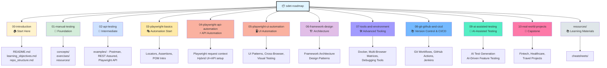
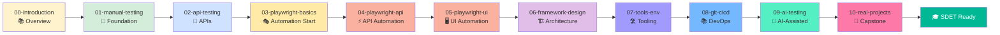
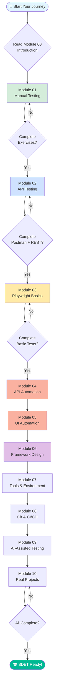

<div align="center" markdown="1">

# 📁 Repository Structure


**A well-organized, progressive learning structure designed for easy navigation and effective learning**

---

</div>

## 📑 Table of Contents

- [Overview](#-overview)
- [Visual Repository Map](#-visual-repository-map)
- [Directory Structure](#-directory-structure)
- [Module Guide](#-module-guide)
- [File Organization](#-file-organization)
- [Navigation Tips](#-navigation-tips)
- [Module Dependencies](#-module-dependencies)
- [Quick Reference](#-quick-reference)

---

## 🎯 Overview

This repository follows a **numbered, sequential structure** designed to guide you through a complete QA to SDET learning journey. Each module folder is prefixed with a number indicating the recommended learning order.

> [!TIP]
> The numeric prefixes (00, 01, 02, etc.) ensure folders are displayed in the correct learning sequence in file explorers and GitHub.

---

## 🗺️ Visual Repository Map


```mermaid
graph TB
    Root[📦 sdet-roadmap]

    Root --> M00[00-introduction<br/>🏠 Start Here]
    Root --> M01[01-manual-testing<br/>🧪 Foundation]
    Root --> M02[02-api-testing<br/>🔌 Intermediate]
    Root --> M03[03-playwright-basics<br/>🎭 Automation Start]
    Root --> M04[04-playwright-api-automation<br/>⚡ API Automation]
    Root --> M05[05-playwright-ui-automation<br/>🖥️ UI Automation]
    Root --> M06[06-framework-design<br/>🏗️ Architecture]
    Root --> M07[07-tools-and-environment<br/>🛠️ Advanced Tooling]
    Root --> M08[08-git-github-and-cicd<br/>📚 Version Control & CI/CD]
    Root --> M09[09-ai-assisted-testing<br/>🤖 AI-Assisted Testing]
    Root --> M10[10-real-world-projects<br/>🚀 Capstone]
    Root --> Res[resources/<br/>📚 Learning Materials]

    M00 --> M00R[README.md<br/>learning_objectives.md<br/>repo_structure.md]
    M01 --> M01C[concepts/<br/>exercises/<br/>resources/]
    M02 --> M02F[examples/ - Postman, REST Assured,<br/>Playwright API]
    M03 --> M03F[Locators, Assertions,<br/>POM Intro]
    M04 --> M04F[Playwright request context<br/>Hybrid UI+API setup]
    M05 --> M05F[UI Patterns, Cross-Browser,<br/>Visual Testing]
    M06 --> M06F[Framework Architecture<br/>Design Patterns]
    M07 --> M07F[Docker, Multi-Browser Matrices,<br/>Debugging Tools]
    M08 --> M08F[Git Workflows, GitHub Actions,<br/>Jenkins]
    M09 --> M09F[AI Test Generation<br/>AI-Driven Feature Testing]
    M10 --> M10F[Fintech, Healthcare,<br/>Travel Projects]
    Res --> ResC[cheatsheets/]

    style Root fill:#e1f5ff,stroke:#333,stroke-width:3px
    style M00 fill:#fff3cd
    style M01 fill:#d4edda
    style M02 fill:#cfe2ff
    style M03 fill:#ffeaa7
    style M04 fill:#fab1a0
    style M05 fill:#fab1a0
    style M06 fill:#e1bee7
    style M07 fill:#a29bfe
    style M08 fill:#74b9ff
    style M09 fill:#55efc4
    style M10 fill:#fd79a8
    style Res fill:#dfe6e9
```

---

## 📂 Directory Structure

### Complete Folder Tree:

```text
sdet-roadmap/
│
├── 00-introduction/                     📍 START HERE
│   ├── README.md                        → Complete roadmap overview
│   ├── learning_objectives.md           → Detailed learning goals
│   └── repo_structure.md                → This file
│
├── 01-manual-testing/                   🧪 MANUAL TESTING (2-3 weeks)
│   ├── concepts/README.md               → Core testing concepts
│   ├── exercises/                       → Hands-on practice
│   │   ├── README.md
│   │   ├── bug-report-template.md
│   │   ├── exploratory-testing-notes.md
│   │   ├── sample-test-cases.md
│   │   └── test-case-template.md
│   └── resources/README.md              → Additional materials
│
├── 02-api-testing/                      🔌 API TESTING (3-4 weeks)
│   ├── README.md                        → Module overview
│   └── examples/
│       ├── postman-api-testing-example.md
│       ├── rest-assured-api-testing-example.md
│       └── playwright-api-testing-example.md
│
├── 03-playwright-basics/                🎭 PLAYWRIGHT BASICS (2 weeks)
│   └── README.md                        → Locators, first tests, POM intro
│
├── 04-playwright-api-automation/        ⚡ PLAYWRIGHT API AUTOMATION (2 weeks)
│   └── README.md                        → `request` context, hybrid tests
│
├── 05-playwright-ui-automation/         🖥️ PLAYWRIGHT UI AUTOMATION (3 weeks)
│   └── README.md                        → UI patterns, cross-browser, visual
│
├── 06-framework-design/                 🏗️ FRAMEWORK DESIGN (3-4 weeks)
│   └── README.md                        → Architecture, patterns, Hybrid framework
│
├── 07-tools-and-environment/            🛠️ TOOLS & ENVIRONMENT (1 week)
│   └── README.md                        → Docker, matrices, debugging
│
├── 08-git-github-and-cicd/              📚 GIT, GITHUB & CI/CD (2-3 weeks)
│   └── README.md                        → Git, GitHub Actions, Jenkins
│
├── 09-ai-assisted-testing/              🤖 AI-ASSISTED TESTING (1-2 weeks)
│   └── README.md                        → AI test generation, AI feature testing
│
├── 10-real-world-projects/              🚀 REAL-WORLD PROJECTS (4-6 weeks)
│   └── README.md                        → Fintech / healthcare / travel capstones
│
├── resources/                           📚 LEARNING RESOURCES
│   ├── README.md                        → Resources overview
│   └── cheatsheets/
│       └── git-commands.md              → Git quick reference
│
├── README.md                            📖 Main repository README
├── LICENSE                              📄 MIT License
└── verify-setup.js                      ✅ Environment verification script
```

---

## 📚 Module Guide

### Detailed Module Breakdown:

#### Module 00: Introduction & Setup
**📂 Directory:** `00-introduction/`
**⏱️ Duration:** 1-2 days
**📊 Difficulty:** ⭐ Beginner
**🎯 Prerequisites:** None

**What's Inside:**
- Complete roadmap overview and learning path
- Detailed learning objectives for all modules
- Repository structure guide (this document)

**Next Module:** → [01-manual-testing](../01-manual-testing/)

---

#### Module 01: Manual Testing Fundamentals
**📂 Directory:** `01-manual-testing/`
**⏱️ Duration:** 2-3 weeks
**📊 Difficulty:** ⭐ Beginner
**🎯 Prerequisites:** Module 00 completed
**📦 Sub-folders:** 3 (concepts, exercises, resources)

**What's Inside:**
- Core testing concepts and terminology
- Black box testing techniques (EP, BVA, Decision Tables, State Transition)
- Test case design and documentation
- Bug reporting and defect lifecycle
- Practical exercises and real-world examples

**Dependencies:** None (foundation module)
**Next Module:** → [02-api-testing](../02-api-testing/)

---

#### Module 02: API Testing (Manual & Automation)
**📂 Directory:** `02-api-testing/`
**⏱️ Duration:** 3-4 weeks
**📊 Difficulty:** ⭐⭐ Intermediate
**🎯 Prerequisites:** Module 01 completed
**📦 Sub-folders:** 1 (examples — Postman, REST Assured, Playwright API)

**What's Inside:**
- API fundamentals (REST, SOAP, GraphQL)
- Manual API testing with Postman
- API automation with REST Assured
- API automation with Playwright

**Dependencies:** Manual Testing concepts
**Next Module:** → [03-playwright-basics](../03-playwright-basics/)

---

#### Module 03: Playwright Basics
**📂 Directory:** `03-playwright-basics/`
**⏱️ Duration:** 2 weeks
**📊 Difficulty:** ⭐⭐ Intermediate
**🎯 Prerequisites:** Modules 01-02 completed, Basic JavaScript

**What's Inside:**
- Playwright installation and configuration
- Locator strategies and best practices
- Basic interactions and assertions
- Page Object Model introduction

**Dependencies:** API Testing, JavaScript basics
**Next Module:** → [04-playwright-api-automation](../04-playwright-api-automation/)

---

#### Module 04: Playwright API Automation
**📂 Directory:** `04-playwright-api-automation/`
**⏱️ Duration:** 2 weeks
**📊 Difficulty:** ⭐⭐⭐ Advanced
**🎯 Prerequisites:** Module 03 completed

**What's Inside:**
- Playwright's `request` context for pure API testing
- Using API calls to set up/tear down test data
- Combining API and UI in one hybrid test

**Dependencies:** Playwright Basics
**Next Module:** → [05-playwright-ui-automation](../05-playwright-ui-automation/)

---

#### Module 05: Playwright UI Automation
**📂 Directory:** `05-playwright-ui-automation/`
**⏱️ Duration:** 3 weeks
**📊 Difficulty:** ⭐⭐⭐ Advanced
**🎯 Prerequisites:** Module 04 completed

**What's Inside:**
- Advanced UI automation patterns (modals, tables, uploads)
- Cross-browser and cross-device testing
- Visual/snapshot testing basics

**Dependencies:** Playwright API Automation
**Next Module:** → [06-framework-design](../06-framework-design/)

---

#### Module 06: Framework Design
**📂 Directory:** `06-framework-design/`
**⏱️ Duration:** 3-4 weeks
**📊 Difficulty:** ⭐⭐⭐⭐ Expert
**🎯 Prerequisites:** Modules 01-05 completed

**What's Inside:**
- Test framework architecture
- Design patterns (POM, Data-Driven, API Mocking — the "Hybrid" pattern)
- Configuration and test data management
- Reporting, logging, error handling

**Dependencies:** All previous automation modules
**Next Module:** → [07-tools-and-environment](../07-tools-and-environment/)

---

#### Module 07: Tools & Environment (Advanced)
**📂 Directory:** `07-tools-and-environment/`
**⏱️ Duration:** 1 week
**📊 Difficulty:** ⭐⭐ Intermediate
**🎯 Prerequisites:** Module 06 completed

**What's Inside:**
- Docker for consistent test environments
- Multi-browser / multi-OS execution matrices
- Debugging tools (Trace Viewer, Inspector)
- Environment and secrets management

**Dependencies:** Framework Design
**Next Module:** → [08-git-github-and-cicd](../08-git-github-and-cicd/)

---

#### Module 08: Git, GitHub & CI/CD
**📂 Directory:** `08-git-github-and-cicd/`
**⏱️ Duration:** 2-3 weeks
**📊 Difficulty:** ⭐⭐⭐ Advanced
**🎯 Prerequisites:** Module 07 completed

**What's Inside:**
- Git fundamentals (clone, commit, push, pull, branch, merge) for test code
- GitHub Actions for test automation
- Jenkins CI/CD pipelines

**Dependencies:** Tools & Environment
**Next Module:** → [09-ai-assisted-testing](../09-ai-assisted-testing/)

---

#### Module 09: AI-Assisted Testing
**📂 Directory:** `09-ai-assisted-testing/`
**⏱️ Duration:** 1-2 weeks
**📊 Difficulty:** ⭐⭐⭐ Advanced
**🎯 Prerequisites:** Module 08 completed

**What's Inside:**
- Generating test cases and Playwright code with AI
- AI-assisted defect triage
- Testing AI-driven product features (fraud detection, dispute triage, chatbots)

**Dependencies:** Git, GitHub & CI/CD
**Next Module:** → [10-real-world-projects](../10-real-world-projects/)

---

#### Module 10: Real-World Projects (Capstone)
**📂 Directory:** `10-real-world-projects/`
**⏱️ Duration:** 4-6 weeks
**📊 Difficulty:** ⭐⭐⭐⭐ Expert
**🎯 Prerequisites:** Modules 00-09 completed

**What's Inside:**
- Fintech application automation (payments, collections, payouts)
- Healthcare and travel domain projects
- Full portfolio-ready test suites and reports

**Dependencies:** Every previous module
**Final Goal:** 🎓 SDET Ready

---

#### Resources Folder
**📂 Directory:** `resources/`
**⏱️ Duration:** Ongoing reference
**📊 Difficulty:** All levels

**What's Inside:**
- Cheatsheets for quick reference
- Community links and recommended reading

**Key Files:**
- `cheatsheets/git-commands.md` - Git quick reference

**Usage:** Reference throughout your learning journey

---

## 🗂️ File Organization

### Common File Types Across Modules:

| File Type | Purpose | Example |
|-----------|---------|---------|
| **README.md** | Module overview, objectives, setup instructions | `01-manual-testing/README.md` |
| **\*.spec.js/ts** | Test files (Playwright convention) | `login.spec.ts` |
| **\*.page.js/ts** | Page Object classes | `LoginPage.ts` |
| **\*.config.js/ts** | Configuration files | `playwright.config.ts` |
| **\*.md** | Documentation files | `examples/postman-api-testing-example.md` |
| **\*.json** | Data files, configs | `test-data.json` |

---

## 🧭 Navigation Tips

### How to Navigate This Repository:

#### 1. **First Time Here?**
```bash
cd 00-introduction
cat README.md
```

#### 2. **Beginning a New Module?**
```bash
# Always read the module README first
cd 01-manual-testing
cat README.md
```

#### 3. **Looking for Examples?**
- Check the module's `examples/` or `exercises/` subfolder
- Look for `*.spec.js`/`*.spec.ts` files once you reach Module 03+

#### 4. **Need Quick Reference?**
```bash
cd resources/cheatsheets
ls -la
```

### Module Completion Checklist:

For each module, ensure you:
- [ ] Read the module README thoroughly
- [ ] Review all concept documents
- [ ] Complete all exercises
- [ ] Build the module deliverables
- [ ] Push your code to GitHub
- [ ] Document what you learned

---

## 🔗 Module Dependencies


```mermaid
graph LR
    M00[00-introduction<br/>📚 Overview] --> M01[01-manual-testing<br/>🧪 Foundation]
    M01 --> M02[02-api-testing<br/>🔌 APIs]
    M02 --> M03[03-playwright-basics<br/>🎭 Automation Start]
    M03 --> M04[04-playwright-api<br/>⚡ API Automation]
    M04 --> M05[05-playwright-ui<br/>🖥️ UI Automation]
    M05 --> M06[06-framework-design<br/>🏗️ Architecture]
    M06 --> M07[07-tools-env<br/>🛠️ Tooling]
    M07 --> M08[08-git-cicd<br/>📚 DevOps]
    M08 --> M09[09-ai-testing<br/>🤖 AI-Assisted]
    M09 --> M10[10-real-projects<br/>🚀 Capstone]
    M10 --> SDET[🎓 SDET Ready]

    style M00 fill:#fff3cd
    style M01 fill:#d4edda
    style M02 fill:#cfe2ff
    style M03 fill:#ffeaa7
    style M04 fill:#fab1a0
    style M05 fill:#fab1a0
    style M06 fill:#e1bee7
    style M07 fill:#a29bfe
    style M08 fill:#74b9ff
    style M09 fill:#55efc4
    style M10 fill:#fd79a8
    style SDET fill:#00b894,color:#fff
```

---

## 📋 Quick Reference

### Module Summary Table:

| # | Module Name | Duration | Difficulty | Prerequisites |
|---|-------------|----------|------------|---------------|
| 00 | Introduction & Setup | 1-2 days | ⭐ | None |
| 01 | Manual Testing | 2-3 weeks | ⭐ | Module 00 |
| 02 | API Testing | 3-4 weeks | ⭐⭐ | Module 01 |
| 03 | Playwright Basics | 2 weeks | ⭐⭐ | Modules 01-02 |
| 04 | Playwright API Automation | 2 weeks | ⭐⭐⭐ | Module 03 |
| 05 | Playwright UI Automation | 3 weeks | ⭐⭐⭐ | Module 04 |
| 06 | Framework Design | 3-4 weeks | ⭐⭐⭐⭐ | Modules 01-05 |
| 07 | Tools & Environment | 1 week | ⭐⭐ | Module 06 |
| 08 | Git, GitHub & CI/CD | 2-3 weeks | ⭐⭐⭐ | Module 07 |
| 09 | AI-Assisted Testing | 1-2 weeks | ⭐⭐⭐ | Module 08 |
| 10 | Real-World Projects | 4-6 weeks | ⭐⭐⭐⭐ | Modules 00-09 |

**Total Learning Time:** 4-6 months (part-time) | 6-8 weeks (full-time)

---

## 🎯 Learning Path Flowchart


```mermaid
flowchart TD
    Start([🎯 Start Your Journey]) --> Read00{Read Module 00<br/>Introduction}

    Read00 --> M01[Module 01<br/>Manual Testing]
    M01 --> Test1{Complete<br/>Exercises?}
    Test1 -->|No| M01
    Test1 -->|Yes| M02[Module 02<br/>API Testing]

    M02 --> Test2{Complete<br/>Postman + REST?}
    Test2 -->|No| M02
    Test2 -->|Yes| M03[Module 03<br/>Playwright Basics]

    M03 --> Test3{Complete<br/>Basic Tests?}
    Test3 -->|No| M03
    Test3 -->|Yes| M04[Module 04<br/>API Automation]

    M04 --> M05[Module 05<br/>UI Automation]
    M05 --> M06[Module 06<br/>Framework Design]
    M06 --> M07[Module 07<br/>Tools & Environment]
    M07 --> M08[Module 08<br/>Git & CI/CD]
    M08 --> M09[Module 09<br/>AI-Assisted Testing]
    M09 --> M10[Module 10<br/>Real Projects]

    M10 --> Final{All Complete?}
    Final -->|No| M10
    Final -->|Yes| Graduate([🎓 SDET Ready!])

    style Start fill:#e1f5ff
    style Graduate fill:#00b894,color:#fff
    style M01 fill:#d4edda
    style M02 fill:#cfe2ff
    style M03 fill:#ffeaa7
    style M04 fill:#fab1a0
    style M05 fill:#fab1a0
    style M06 fill:#e1bee7
```

---

<div align="center" markdown="1">

## 🚀 Ready to Navigate?

**Use this guide as your map throughout your SDET learning journey!**

### 📚 **[Return to Introduction →](./README.md)**

### 📖 **[View Learning Objectives →](./learning_objectives.md)**

### 🧪 **[Start Module 01: Manual Testing →](../01-manual-testing/)**

---

**[⬆ Back to Top](#-repository-structure)**

*Last Updated: July 2026*

</div>
