# 🧪 Manual Testing – Core Concepts


> **Master the fundamental concepts of manual testing that form the backbone of software quality assurance—applicable across all domains, tools, and technologies.**

---

## 📑 Table of Contents

- [Overview](#-overview)
- [Why Manual Testing Matters](#-why-manual-testing-matters)
- [Core Testing Concepts](#-core-testing-concepts)
  - [1. Types of Testing](#1️⃣-types-of-testing)
  - [2. Black Box Testing Techniques](#2️⃣-black-box-testing-techniques)
  - [3. Levels of Testing](#3️⃣-levels-of-testing)
  - [4. Defect Life Cycle](#4️⃣-defect-life-cycle)
  - [5. Severity vs Priority](#5️⃣-severity-vs-priority)
  - [6. Test Coverage](#6️⃣-test-coverage)
  - [7. Testing Principles](#7️⃣-testing-principles)
- [Testing Comparisons](#-testing-comparisons)
- [Best Practices](#-best-practices)
- [Common Pitfalls](#-common-pitfalls)
- [Additional Resources](#-additional-resources)
- [Next Steps](#-next-steps)

---

## 🎯 Overview

This section covers the **fundamental concepts of manual testing** that every QA engineer must clearly understand before moving into automation.

These concepts form the backbone of **software quality assurance** and are applicable across:
- 🌐 All domains (web, mobile, API, desktop)
- 🛠️ All tools and technologies
- 📊 All project methodologies (Agile, Waterfall, DevOps)

> [!IMPORTANT]
> Automation tools and frameworks are effective **only when built on strong testing fundamentals**. Understanding these concepts is non-negotiable for any QA professional.

---

## 💡 Why Manual Testing Matters


### Key Benefits:

✅ **Exploratory Testing** - Discover unexpected issues automation can't find  
✅ **Usability Testing** - Evaluate user experience and interface intuitiveness  
✅ **Ad-hoc Testing** - Quickly validate fixes without scripting overhead  
✅ **Flexible Execution** - Adapt test approach based on findings  
✅ **Critical Thinking** - Develop problem-solving skills essential for automation  
✅ **Domain Expertise** - Build deep understanding of application behavior  

---

## 📚 Core Testing Concepts

## 1️⃣ Types of Testing


---

### 1.1 Functional Testing

Functional testing verifies that the application behaves according to **business requirements and functional specifications**.

#### 📖 Definition

Testing the **"what"** of the application—what features does it provide and do they work correctly?

#### 🎯 Focus Areas:

- ✅ **Input validation** - Correct handling of user inputs
- ✅ **Business logic** - Rules and workflows execute correctly
- ✅ **User workflows** - End-to-end scenarios complete successfully
- ✅ **System responses** - Expected outputs for given inputs
- ✅ **Error handling** - Graceful handling of invalid operations

#### 💡 Examples:

**Login Functionality:**
```
✓ User can log in with valid credentials
✓ User is blocked with invalid credentials
✓ Password masking works correctly
✓ "Forgot Password" link navigates properly
✓ Account locks after 3 failed attempts
```

**E-commerce Cart:**
```
✓ Items can be added to cart
✓ Quantity can be updated
✓ Items can be removed
✓ Cart total calculates correctly
✓ Free shipping applied when threshold met
```

#### 🔍 When to Perform:

- After new features are developed
- During sprint testing
- Before regression testing
- As part of UAT

---

### 1.2 Regression Testing

Regression testing ensures that **existing functionalities continue to work correctly** after changes.

#### 📖 Definition

Testing to verify that recent code changes haven't adversely affected existing features.

#### 🎯 Triggers for Regression Testing:

- 🆕 **New feature additions** - Ensure integrations don't break old features
- 🐛 **Bug fixes** - Verify fix doesn't introduce new issues
- 🔄 **Code refactoring** - Confirm behavior remains unchanged
- ⚙️ **Configuration changes** - Validate system still works correctly
- 🔌 **Third-party updates** - Check compatibility with library upgrades

#### 💡 Strategy:

```mermaid
flowchart TD
    A[Code Change] --> B{Impact Analysis}
    B -->|High Impact| C[Full Regression Suite]
    B -->|Medium Impact| D[Selective Regression]
    B -->|Low Impact| E[Smoke + Sanity Tests]
    
    C --> F[Execute Tests]
    D --> F
    E --> F
    
    F --> G{All Tests Pass?}
    G -->|Yes| H[✅ Deploy]
    G -->|No| I[🐞 Fix Issues]
    I --> F
    
    style C fill:#ffcccc
    style H fill:#d4edda
    style I fill:#f8d7da
```



> [!TIP]
> Regression testing is repetitive in nature and is a **strong candidate for automation**. Automate stable, frequently-run regression tests to save time.

#### 📊 Best Practices:

| Practice | Description |
|----------|-------------|
| **Prioritize test cases** | Critical features first, then medium, then low priority |
| **Maintain test suite** | Remove obsolete tests, update for requirement changes |
| **Automate where possible** | Reduce manual effort for repetitive tests |
| **Track coverage** | Ensure all critical paths are tested |

---

### 1.3 Smoke Testing

Smoke testing is a **shallow and wide** test performed to verify that **critical functionalities** of a build are working.

#### 📖 Definition

A quick, broad test to check if the "house is on fire" (critical failures exist).

#### 🎯 Objective:

Verify that the build is **stable enough** for detailed testing.

#### ⏱️ Performed When:

- 🏗️ A new build is deployed
- 🔄 Before detailed testing begins
- 🚀 After environment setup
- 📦 Before release to QA team

#### ✅ Outcome:

```
Pass → Proceed with detailed testing
Fail → Reject the build (send back to development)
```

#### 💡 Example Smoke Test Suite:

**E-commerce Application:**
```markdown
1. ✓ Application launches successfully
2. ✓ Homepage loads without errors
3. ✓ User can log in
4. ✓ Product search returns results
5. ✓ Product can be added to cart
6. ✓ Checkout page loads
7. ✓ Order can be placed
8. ✓ User can log out
```

**Duration:** Typically 15-30 minutes for manual execution

---

### 1.4 Sanity Testing

Sanity testing is a **focused and narrow** test performed after minor changes to verify that a **specific functionality or bug fix** works as expected.

#### 📖 Definition

A quick check to ensure a specific functionality works correctly after a change.

#### 🎯 Objective:

Verify that the **targeted fix or feature** works without breaking related functionality.

#### 💡 Example:

**Bug Fix:** "Login button remained disabled after entering valid credentials"

**Sanity Test:**
```markdown
1. Navigate to login page
2. Enter valid credentials
3. ✓ Verify button becomes enabled
4. Click login button
5. ✓ Verify successful login
6. ✓ Verify related logout functionality still works
```

---

### 1.5 Smoke vs Sanity Comparison

| Aspect | Smoke Testing | Sanity Testing |
|--------|---------------|----------------|
| **Scope** | Broad (entire application) | Narrow (specific feature) |
| **Depth** | Shallow | Focused |
| **Purpose** | Build stability verification | Specific fix verification |
| **Performed By** | Developers or QA | QA Team |
| **Documentation** | May be documented | Usually undocumented |
| **When** | New build deployment | After bug fix or minor change |
| **Example** | Test all major features briefly | Test only the fixed login issue |

---

## 2️⃣ Black Box Testing Techniques


### 📖 Overview

Black box testing focuses on **testing the system without knowledge of internal code or implementation**. Test cases are derived from **requirements and specifications**.

---

### 2.1 Equivalence Partitioning (EP)

#### 📖 Concept

Divide input data into **equivalence classes** where all values in a class should behave similarly. Test **one representative value from each partition**.

#### 🎯 Benefits:

- ✅ **Reduces test cases** - From thousands to manageable numbers
- ✅ **Maintains coverage** - Still tests all scenarios effectively
- ✅ **Improves efficiency** - Less time, same quality

#### 💡 Example 1: Age Field Validation

**Requirement:** Valid age range is `18–60`

**Equivalence Classes:**

| Partition | Range | Type | Test Values | Expected Result |
|-----------|-------|------|-------------|-----------------|
| P1 | age < 18 | Invalid | 10, 15, 17 | ❌ Error message |
| P2 | 18 ≤ age ≤ 60 | Valid | 25, 40, 55 | ✅ Accepted |
| P3 | age > 60 | Invalid | 65, 80, 100 | ❌ Error message |

**Test Cases:**
```
TC-EP-01: Enter age = 15 → Expected: Error "Age must be 18-60"
TC-EP-02: Enter age = 30 → Expected: Age accepted
TC-EP-03: Enter age = 70 → Expected: Error "Age must be 18-60"
```

#### 💡 Example 2: Discount Code

**Requirement:**
- `SAVE10` → 10% discount
- `SAVE20` → 20% discount
- Other codes → Invalid

**Equivalence Classes:**
```
Valid Class 1: SAVE10
Valid Class 2: SAVE20
Invalid Class: Any other string
```

---

### 2.2 Boundary Value Analysis (BVA)

#### 📖 Concept

Test values at the **boundaries** of input ranges, where defects are most likely to occur.

#### 🎯 Why Boundaries?

Developers often make mistakes in boundary conditions:
- Off-by-one errors
- Incorrect comparison operators (`<` vs `<=`)
- Edge case handling

#### 🔍 BVA Rule:

For range `[min, max]`, test:
- **min - 1** (just below minimum)
- **min** (minimum boundary)
- **min + 1** (just above minimum)
- **max - 1** (just below maximum)
- **max** (maximum boundary)
- **max + 1** (just above maximum)

#### 💡 Example: Password Length (8-16 characters)

| Test Case | Length | Input | Expected Result |
|-----------|--------|-------|-----------------|
| TC-BVA-01 | 7 | Test@12 | ❌ Error: "Min 8 chars" |
| TC-BVA-02 | 8 | Test@123 | ✅ Valid |
| TC-BVA-03 | 9 | Test@1234 | ✅ Valid |
| TC-BVA-04 | 15 | Test@1234567890 | ✅ Valid |
| TC-BVA-05 | 16 | Test@12345678901 | ✅ Valid |
| TC-BVA-06 | 17 | Test@123456789012 | ❌ Error: "Max 16 chars" |

---

### 2.3 Decision Table Testing

#### 📖 Concept

Use a **decision table** to capture complex business rules involving multiple conditions and corresponding actions.

#### 🎯 Best Suited For:

- Complex business logic
- Multiple input combinations
- Different outcomes based on condition combinations

#### 💡 Example: Loan Approval System

**Business Rules:**
```
Loan approved if:
- Income ≥ $50,000 AND
- Credit Score ≥ 700
```

**Decision Table:**

| Rule | R1 | R2 | R3 | R4 |
|------|----|----|----|----|
| **Conditions** |
| Income ≥ $50K | ✅ Yes | ✅ Yes | ❌ No | ❌ No |
| Credit ≥ 700 | ✅ Yes | ❌ No | ✅ Yes | ❌ No |
| **Actions** |
| Approve Loan | ✅ | ❌ | ❌ | ❌ |
| Reject Loan | ❌ | ✅ | ✅ | ✅ |
| Rejection Reason | - | Low Credit | Low Income | Both Insufficient |

**Derived Test Cases:**
```
TC-DT-01 (R1): Income=$60K, Credit=750 → Approved
TC-DT-02 (R2): Income=$60K, Credit=650 → Rejected (Low Credit)
TC-DT-03 (R3): Income=$40K, Credit=750 → Rejected (Low Income)
TC-DT-04 (R4): Income=$40K, Credit=650 → Rejected (Both)
```

---

### 2.4 State Transition Testing

#### 📖 Concept

Test **state changes** triggered by events or actions in systems where behavior depends on current state.

#### 🎯 When to Use:

- User account states
- Order processing workflows
- Application menu navigation
- Session management

#### 💡 Example: User Account States


**Test Cases:**

| Test ID | Current State | Event | Expected New State |
|---------|---------------|-------|-------------------|
| TC-ST-01 | Inactive | Verify Email | Active |
| TC-ST-02 | Active | 3 Failed Logins | Locked |
| TC-ST-03 | Locked | Wait 15 Minutes | Active |
| TC-ST-04 | Active | Admin Suspends | Suspended |
| TC-ST-05 | Suspended | Admin Reactivates | Active |

**Invalid Transitions (Negative Testing):**
```
TC-ST-NEG-01: Inactive → Locked (should not be possible)
TC-ST-NEG-02: Deleted → Active (should not be possible)
```

---

## 3️⃣ Levels of Testing


### Testing Pyramid Concept

```mermaid
graph TD
    subgraph " "
        A["🔺 Acceptance Tests<br/>(Few, Slow, Expensive)"]
        B["System Tests<br/>(Some, Medium Speed)"]
        C["Integration Tests<br/>(More, Faster)"]
        D["Unit Tests<br/>(Many, Fast, Cheap)"]
    end
    
    A --> B --> C --> D
    
    style A fill:#fab1a0
    style B fill:#ffeaa7
    style C fill:#fff3cd
    style D fill:#d4edda
```



---

### 3.1 Unit Testing

#### 📖 Definition

Tests **individual components or functions** in isolation.

#### 🎯 Characteristics:

- 🔬 **Scope:** Single function/method/class
- 👨‍💻 **Performed By:** Developers
- ⚡ **Speed:** Very fast (milliseconds)
- 🎯 **Focus:** Internal logic and algorithms
- 🛠️ **Tools:** JUnit, pytest, Jest, NUnit

#### 💡 Example:

```python
# Function to test
def calculate_discount(price, discount_percent):
    if discount_percent < 0 or discount_percent > 100:
        raise ValueError("Discount must be 0-100")
    return price * (1 - discount_percent / 100)

# Unit test
def test_calculate_discount():
    assert calculate_discount(100, 10) == 90
    assert calculate_discount(100, 0) == 100
    assert calculate_discount(100, 100) == 0
```

---

### 3.2 Integration Testing

#### 📖 Definition

Verifies **interaction between multiple modules** or components.

#### 🎯 Characteristics:

- 🔗 **Scope:** Multiple connected components
- 🧪 **Performed By:** Developers or QA
- ⏱️ **Speed:** Moderate
- 🎯 **Focus:** Data flow and communication between modules
- 📊 **Approach:** Top-down, Bottom-up, or Big Bang

#### 💡 Example:

**Testing Integration:**
```
Login Module + Database Module
↓
Test: User authentication flow
- Login service calls database
- Database returns user record
- Login service validates credentials
- Session is created
```

#### 🔍 Integration Approaches:

| Approach | Description | When to Use |
|----------|-------------|-------------|
| **Big Bang** | Integrate all modules at once | Small systems |
| **Top-Down** | Start from top-level modules | UI-driven applications |
| **Bottom-Up** | Start from low-level modules | API-driven systems |
| **Sandwich** | Combine top-down and bottom-up | Large complex systems |

---

### 3.3 System Testing

#### 📖 Definition

**End-to-end testing** of the complete application as a whole.

#### 🎯 Characteristics:

- 🌐 **Scope:** Entire application
- 👤 **Performed By:** QA Team
- 📍 **Environment:** Production-like (staging)
- 🎯 **Focus:** Functional and non-functional requirements
- 📋 **Types:** Functional, Performance, Security, Usability

#### 💡 Example Test Scenarios:

**E-commerce System Testing:**
```
1. User Registration → Login → Browse Products
2. Add to Cart → Apply Coupon → Checkout
3. Payment Processing → Order Confirmation
4. Email Notification → Order Tracking
5. Returns and Refunds Flow
```

#### 📊 System Testing Types:


---

### 3.4 Acceptance Testing

#### 📖 Definition

Validates system **readiness for production** from a business perspective.

#### 🎯 Characteristics:

- ✅ **Scope:** Business requirements validation
- 👥 **Performed By:** Business users, clients, or QA
- 📍 **Environment:** Production or production-like
- 🎯 **Focus:** User needs and business goals
- 📋 **Types:** UAT, Alpha, Beta testing

#### 💡 UAT (User Acceptance Testing) Example:

**Banking Application:**
```
Business User Tests:
1. Can I transfer funds between accounts?
2. Do transaction limits work correctly?
3. Are notifications sent as expected?
4. Can I download statements in required format?
5. Does the mobile app match desktop functionality?
```

#### 📊 Acceptance Criteria:

```markdown
**Feature:** Online Bill Payment

**Acceptance Criteria:**
✓ User can select payee from saved list
✓ User can add new payee with validation
✓ Payment amount is validated (min/max)
✓ Payment date can be scheduled for future
✓ Confirmation email is sent
✓ Transaction appears in history within 5 minutes
```

---

## 4️⃣ Defect Life Cycle


### 📖 Defect State Definitions

| State | Description | Responsible Party | Action Required |
|-------|-------------|-------------------|-----------------|
| **New** | Defect identified and logged | QA | Document issue completely |
| **Assigned** | Assigned to developer | Dev Lead | Review and plan fix |
| **Open** | Developer working on fix | Developer | Implement solution |
| **Fixed** | Fix implemented in code | Developer | Update status, add fix notes |
| **Ready for Retest** | Fix deployed to test environment | DevOps/QA | Prepare for verification |
| **Retest** | QA verifying the fix | QA | Execute test cases |
| **Verified** | Fix confirmed working | QA | Final validation |
| **Closed** | Defect resolved successfully | QA/PM | Archive and track metrics |
| **Reopened** | Fix incomplete or failed | QA | Log additional details |
| **Rejected** | Not a bug, duplicate, or won't fix | Dev Lead/PM | Document reason |

### 📊 Rejection Reasons:

| Reason | Description | Example |
|--------|-------------|---------|
| **Not a Bug** | Working as designed | "Error message is intentional for that scenario" |
| **Duplicate** | Already reported | "Same as BUG-1234" |
| **Cannot Reproduce** | Unable to replicate | "Following steps doesn't produce error" |
| **Won't Fix** | Business decision not to fix | "Low priority cosmetic issue" |
| **By Design** | Intended behavior | "This is per product requirements" |

> [!TIP]
> Always document **rejection reasons** clearly to maintain team transparency and reduce future duplicates.

---

## 5️⃣ Severity vs Priority

### 📊 Decision Matrix


---

### 🔴 Severity

**Definition:** Indicates the **technical impact** of the defect on the system.

| Level | Description | Examples | System Impact |
|-------|-------------|----------|---------------|
| **🔴 Critical** | System crash, data loss, security breach | App crashes on launch, data corruption, SQL injection | ❌ System unusable |
| **🟠 High** | Major functionality broken, blocking workflow | Cannot login, payment fails, checkout broken | ⚠️ Major feature broken |
| **🟡 Medium** | Partial functionality affected, workaround exists | Search slow, filter not working, validation error | ⚡ Minor feature affected |
| **🟢 Low** | UI or cosmetic issue, minimal impact | Text alignment, color mismatch, typo | ✏️ Cosmetic only |

---

### ⏰ Priority

**Definition:** Indicates **how urgently** the defect must be fixed from a business perspective.

| Level | Description | Response Time | Examples |
|-------|-------------|---------------|----------|
| **P0 - Critical** | Production down, severe revenue impact | Immediate (hours) | Payment gateway down, site inaccessible |
| **P1 - High** | Major feature broken, affects many users | < 24 hours | Login broken for all users |
| **P2 - Medium** | Moderate impact, affects some users | < 1 week | Feature works but has workaround |
| **P3 - Low** | Minor issue, affects few users | Next sprint | Cosmetic issue, rare edge case |

---

### 📋 Real-World Examples

#### Example 1: High Severity, High Priority
```
Bug: Payment gateway returns error for all transactions
Severity: Critical (major functionality broken)
Priority: Critical (revenue impact)
Action: Drop everything and fix immediately
```

#### Example 2: High Severity, Low Priority
```
Bug: App crashes when entering special character 'ș' in name field
Severity: High (application crash)
Priority: Low (rare character, affects <0.1% users)
Action: Schedule for next sprint, document workaround
```

#### Example 3: Low Severity, High Priority
```
Bug: Company logo appears blurry on homepage
Severity: Low (cosmetic issue)
Priority: High (brand image, high visibility page)
Action: Fix before next release
```

#### Example 4: Low Severity, Low Priority
```
Bug: Tooltip text has minor typo on rarely-used admin page
Severity: Low (cosmetic)
Priority: Low (low traffic page)
Action: Add to backlog for future fix
```

---

### 🎯 Key Differences

| Aspect | Severity | Priority |
|--------|----------|----------|
| **Perspective** | Technical team | Business/Product team |
| **Measures** | Impact on system | Urgency for users |
| **Determined By** | QA/Developers | Product Manager/Stakeholders |
| **Question** | How bad is the impact? | How soon must it be fixed? |
| **Can Change?** | Rarely | Often (based on business needs) |

> [!NOTE]
> **Severity** is typically set by QA based on technical impact. **Priority** is often adjusted by Product/Business teams based on customer impact and business goals.

---

## 6️⃣ Test Coverage

### 📖 Definition

Test coverage measures **how much of the application** is tested.

### 📊 Types of Coverage:


### 🎯 Coverage Metrics:

| Metric | Formula | Target | Notes |
|--------|---------|--------|-------|
| **Requirement Coverage** | (Requirements Tested / Total Requirements) × 100 | 100% | Critical for UAT |
| **Feature Coverage** | (Features Tested / Total Features) × 100 | 90%+ | Prioritize critical features |
| **Test Case Execution** | (Executed Tests / Total Tests) × 100 | 100% | Before release |
| **Defect Coverage** | (Defects Found / Total Defects) × 100 | Unknown | Estimate using sampling |

> [!WARNING]
> **100% coverage ≠ 100% quality**. Coverage measures breadth, not depth. Quality testing requires both coverage AND thorough test design.

---

## 7️⃣ Testing Principles

### 📜 Seven Principles of Software Testing


#### 1️⃣ Testing Shows Presence of Defects

Testing can prove defects exist, but **cannot prove they don't exist**.

#### 2️⃣ Exhaustive Testing is Impossible

Testing every combination is impractical. Use **risk-based prioritization**.

#### 3️⃣ Early Testing Saves Time and Money

**Shift-left testing** - find bugs early when they're cheaper to fix.

#### 4️⃣ Defects Cluster Together

**Pareto principle:** 80% of defects come from 20% of modules. Focus testing accordingly.

#### 5️⃣ Pesticide Paradox

Repeating same tests won't find new bugs. **Regularly review and update test cases**.

#### 6️⃣ Testing is Context-Dependent

Different applications need different testing approaches (e-commerce ≠ medical device).

#### 7️⃣ Absence-of-Errors Fallacy

Bug-free software that doesn't meet user needs is useless. **Test for business value**.

---

## 🔄 Testing Comparisons

### Smoke vs Sanity vs Regression

| Aspect | Smoke Testing | Sanity Testing | Regression Testing |
|--------|---------------|----------------|-------------------|
| **Scope** | Broad (entire app) | Narrow (specific feature) | Medium to Full |
| **Depth** | Shallow | Focused | Deep |
| **Purpose** | Build stability | Specific fix verification | Ensure no side effects |
| **Performed By** | Dev or QA | QA | QA |
| **Automation** | Often automated | Usually manual | Highly recommended |
| **Time** | 15-30 minutes | 10-20 minutes | Hours to days |
| **When** | New build | After bug fix | After any code change |

---

### Manual vs Automated Testing

| Aspect | Manual Testing | Automated Testing |
|--------|----------------|-------------------|
| **Best For** | Exploratory, usability, ad-hoc | Regression, load, repetitive tests |
| **Initial Cost** | Low | High (tool + script development) |
| **Execution Speed** | Slow | Fast |
| **Repeatability** | Variable | Consistent |
| **Flexibility** | High | Low (requires script changes) |
| **Human Insight** | High | None |
| **ROI** | Quick for one-time tests | High for long-term projects |

---

## 🧠 Best Practices

### ✅ DO:

- ✔️ **Understand requirements thoroughly** before testing
- ✔️ **Create test cases early** (during requirement phase)
- ✔ **Focus on critical paths** first
- ✔️ **Test negative scenarios** (error handling)
- ✔️ **Document test results** clearly
- ✔️ **Reproduce bugs consistently** before logging
- ✔️ **Communicate with developers** professionally
- ✔️ **Update test cases** when requirements change
- ✔️ **Prioritize based on risk** and impact
- ✔️ **Learn from production defects** and improve tests

### ❌ DON'T:

- ✖️ **Don't test without understanding requirements**
- ✖️ **Don't only test happy paths** (positive scenarios)
- ✖️ **Don't skip exploratory testing**
- ✖️ **Don't log bugs without reproducible steps**
- ✖️ **Don't blame developers** for bugs
- ✖️ **Don't assume automation replaces manual testing**
- ✖️ **Don't ignore edge cases**
- ✖️ **Don't test in production** (unless specifically allowed)

---

## ⚠️ Common Pitfalls

| Pitfall | Why It's Bad | Solution |
|---------|--------------|----------|
| **Testing without requirements** | Unclear acceptance criteria | Always review requirements first |
| **Only testing happy paths** | Misses majority of real-world issues | For each positive test, write 2-3 negative tests |
| **Skipping documentation** | Can't reproduce or track issues | Document all test cases and defects |
| **Not retesting fixes** | Bugs reappear in production | Always verify fixes before closing bugs |
| **Ignoring environment differences** | "Works on my machine" syndrome | Test in environment matching production |
| **Testing too late** | Expensive fixes | Shift-left: test early and often |
| **100% coverage goal** | Wastes time on low-value tests | Prioritize based on risk and business value |

---

## 📚 Additional Resources

### 📖 Recommended Reading

- 📘 [ISTQB Foundation Level Syllabus](https://www.istqb.org/certifications/certified-tester-foundation-level) - Industry standard certification
- 📗 [Software Testing by Ron Patton](https://www.amazon.com/Software-Testing-Ron-Patton/dp/0672327988) - Beginner-friendly introduction
- 📕 [Lessons Learned in Software Testing by Kaner, Bach, Pettichord](https://www.amazon.com/Lessons-Learned-Software-Testing-Context-Driven/dp/0471081124) - Practical wisdom
- 📙 [Agile Testing by Lisa Crispin](https://www.amazon.com/Agile-Testing-Practical-Guide-Testers/dp/0321534468) - Testing in Agile

### 🎥 Video Tutorials

- [Software Testing Tutorial - Guru99](https://www.guru99.com/software-testing.html)
- [ISTQB Foundation Course - Udemy](https://www.udemy.com/topic/istqb/)
- [Manual Testing - YouTube Playlists](https://www.youtube.com/results?search_query=manual+testing+tutorial)

### 🌐 Websites & Blogs

- [Ministry of Testing](https://www.ministryoftesting.com/) - Community and resources
- [Software Testing Help](https://www.softwaretestinghelp.com/) - Tutorials and guides
- [Google Testing Blog](https://testing.googleblog.com/) - Industry insights
- [Test Automation University](https://testautomationu.applitools.com/) - Free courses

### 🏆 Certifications

- **ISTQB Certified Tester Foundation Level (CTFL)** - Industry standard
- **ASTQB Mobile Tester** - Mobile-specific testing
- **CSTE (Certified Software Tester)** - QAI certification

---

## 🎯 Next Steps

### Learning Path

```mermaid
graph LR
    A[✅ Master<br/>Concepts] --> B[✍️ Practice<br/>Exercises]
    B --> C[📝 Build<br/>Portfolio]
    C --> D[🎓 Get<br/>Certified]
    D --> E[💼 Apply<br/>Skills]
    
    style A fill:#d4edda
    style B fill:#fff3cd
    style C fill:#ffeaa7
    style D fill:#fab1a0
    style E fill:#e1f5ff
```



### 1. **Practice Exercises**

Proceed to: [`1_manual_testing/exercises/`](../exercises/)

Apply these concepts through hands-on practice:
- ✍️ Write test scenarios and test cases
- 🧪 Apply black box techniques
- 🐞 Practice bug reporting
- 🔍 Perform exploratory testing

### 2. **Build Portfolio**

Document your work:
- Create test plans for sample applications
- Write comprehensive test cases
- Log sample bug reports
- Showcase on GitHub

### 3. **Get Certified**

Consider ISTQB Foundation Level certification to:
- Validate your knowledge
- Improve employability
- Learn industry terminology

### 4. **Continue Learning**

**Next Module:** [`02-api-testing/`](../../02-api-testing/)
- Learn API testing fundamentals
- Practice with Postman
- Understand REST/SOAP protocols
- Write API automation tests

---

## 📄 Version History

| Version | Date | Changes |
|---------|------|---------|
| 2.0 | 2026-02-09 | Major enhancement: Added badges, 6 Mermaid diagrams, detailed explanations with real-world examples, comparison tables, testing pyramid, coverage metrics, testing principles, best practices, common pitfalls, expanded resources |
| 1.5 | 2026-01-15 | Added defect lifecycle and severity vs priority |
| 1.0 | 2025-11-10 | Initial manual testing concepts |

---

## 🤝 Contributing

Help improve this learning resource!

**How to Contribute:**
1. 🍴 Fork this repository
2. ✏️ Add examples or improve explanations
3. 📝 Share real-world scenarios
4. 🚀 Submit a pull request

**Ideas for contributions:**
- Industry-specific examples
- Additional diagrams
- Practice quizzes
- Video explanations

---

<div align="center">

**⭐ Strong fundamentals lead to successful automation! ⭐**

Made with ❤️ for aspiring QA Engineers | Last Updated: February 2026

**[⬆ Back to Top](#-manual-testing--core-concepts)**

</div>