# 📝 Manual Testing – Exercises & Practice


> **Transform theoretical knowledge into practical QA skills through hands-on exercises designed to build professional manual testing expertise.**

---

## 📑 Table of Contents

- [Overview](#-overview)
- [Learning Objectives](#-learning-objectives)
- [Getting Started](#-getting-started)
- [Exercise Structure](#-exercise-structure)
- [Exercises](#-exercises)
  - [1. Test Scenario Writing](#1️⃣-test-scenario-writing)
  - [2. Test Case Design](#2️⃣-test-case-design)
  - [3. Black Box Testing Techniques](#3️⃣-black-box-testing-techniques)
  - [4. Exploratory Testing](#4️⃣-exploratory-testing)
  - [5. Defect Reporting Practice](#5️⃣-defect-reporting-practice)
  - [6. Test Execution & Observation](#6️⃣-test-execution--observation)
  - [7. Advanced Exercises](#7️⃣-advanced-exercises)
- [Practice Templates](#-practice-templates)
- [Progress Tracker](#-progress-tracker)
- [Best Practices](#-best-practices)
- [Common Mistakes](#-common-mistakes)
- [Additional Resources](#-additional-resources)
- [Next Steps](#-next-steps)

---

## 🎯 Overview

This section focuses on **hands-on practice** to apply manual testing concepts covered in the **Concepts** section.

These exercises are designed to help you **think like a QA engineer**, not just follow steps. The objective is to convert **theoretical knowledge into practical testing skills** that you'll use in real-world projects.

### Why Practice Matters

```mermaid
graph LR
    A[📖 Theory] --> B[💡 Understanding]
    B --> C[✍️ Practice]
    C --> D[🎯 Skill Mastery]
    D --> E[💼 Real-World Application]
    
    style A fill:#e1f5ff
    style C fill:#fff3cd
    style E fill:#d4edda
```



> [!IMPORTANT]
> Manual testing skills are built through **practice and repetition**, not theory alone. Consistent practice sharpens analytical thinking, attention to detail, and communication quality.

---

## 🎓 Learning Objectives

By completing the exercises in this section, you will be able to:

✅ **Understand requirements clearly** - Extract testable criteria from specifications  
✅ **Derive test scenarios and test cases** - Create comprehensive test coverage  
✅ **Apply black box testing techniques** - Use structured methods like BVA, EP, Decision Tables  
✅ **Identify edge cases and negative scenarios** - Think beyond happy paths  
✅ **Log high-quality, reproducible defects** - Write bug reports that developers can act on  
✅ **Execute tests systematically** - Follow disciplined test execution practices  
✅ **Analyze test results** - Distinguish root causes from symptoms  

---

## 🚀 Getting Started

### Prerequisites

Before starting these exercises, ensure you have:
- [ ] Completed the **Manual Testing Concepts** section
- [ ] Reviewed the practice templates in this directory
- [ ] Set up a test environment or selected a practice application

### Recommended Approach

1. **Start with fundamentals** - Begin with Test Scenario Writing
2. **Progress sequentially** - Each exercise builds on previous skills
3. **Practice regularly** - Dedicate 30-60 minutes daily
4. **Document your work** - Keep a learning journal
5. **Review and reflect** - Analyze what you learned after each exercise

> [!TIP]
> Use real applications for practice: open-source projects, demo sites, or even GitHub itself!

---

## 📐 Exercise Structure

Each exercise follows this format:

```mermaid
graph TD
    A[📝 Objective] --> B[🎯 Exercise Description]
    B --> C[💡 Example/Guidance]
    C --> D[✍️ Your Practice]
    D --> E[✅ Self-Review]
    E --> F{Understood?}
    F -->|Yes| G[Next Exercise]
    F -->|No| H[Review Concepts]
    H --> D
    
    style A fill:#d1ecf1
    style D fill:#fff3cd
    style G fill:#d4edda
```



---

## 📚 Exercises

## 1️⃣ Test Scenario Writing

### 🎯 Objective
Practice identifying **high-level test scenarios** based on requirements.

### 📖 What is a Test Scenario?

A test scenario is a **high-level description of what to test**, without detailed steps. It answers "**What to test?**" not "**How to test?**"

**Example:**
- ❌ Bad: "Enter email and password, click login"
- ✅ Good: "Verify login functionality with valid credentials"

---

### ✍️ Exercise 1.1: Login Feature Scenarios

**Requirement:**
```
Users should be able to log in using email and password. 
After 3 failed attempts, the account should be locked for 15 minutes.
```

**Your Task:** Write test scenarios covering:
- ✅ Positive scenarios
- ❌ Negative scenarios
- 🔢 Boundary conditions
- 🔒 Security considerations
- 🎨 Usability checks

### 💡 Sample Scenarios:

| Scenario ID | Test Scenario | Category |
|-------------|---------------|----------|
| TS-001 | Verify login with valid credentials | Positive |
| TS-002 | Verify error message for invalid password | Negative |
| TS-003 | Verify account lock after 3 failed attempts | Security |
| TS-004 | Verify account unlocks after 15 minutes | Security |
| TS-005 | Verify login behavior when fields are left blank | Negative |
| TS-006 | Verify password masking in password field | Security |
| TS-007 | Verify "Remember Me" functionality | Functional |
| TS-008 | Verify "Forgot Password" link navigation | Functional |
| TS-009 | Verify login with SQL injection attempt | Security |
| TS-010 | Verify login response time under load | Performance |

---

### ✍️ Exercise 1.2: E-commerce Cart Scenarios

**Requirement:**
```
Users can add/remove items from cart. Cart persists across sessions.
Max 10 items per product. Free shipping over $50.
```

**Your Task:** Write 10-12 test scenarios covering:
- Adding items
- Removing items
- Quantity limits
- Session persistence
- Free shipping calculation
- Edge cases

> [!TIP]
> Think about what could go wrong: negative quantities, special characters in inputs, session timeout scenarios.

---

## 2️⃣ Test Case Design

### 🎯 Objective
Convert test scenarios into **detailed, executable test cases**.

### 📖 Test Scenario vs Test Case

| Aspect | Test Scenario | Test Case |
|--------|--------------|-----------|
| **Level** | High-level | Detailed |
| **Focus** | What to test | How to test |
| **Steps** | Not included | Step-by-step |
| **Data** | Generic | Specific |
| **Example** | "Verify login functionality" | "1. Enter email: test@example.com 2. Enter password: Test@123..." |

---

### ✍️ Exercise 2.1: Convert Scenario to Test Case

**Given Scenario:** "Verify login with valid credentials"

**Your Task:** Create a detailed test case using this template:

```markdown
**Test Case ID:** TC-LOGIN-001
**Test Scenario:** Verify login with valid credentials
**Priority:** High
**Severity:** Critical

**Preconditions:**
- User account exists with email: testuser@example.com
- User is logged out
- Browser: Chrome (latest version)

**Test Steps:**
1. Navigate to https://app.example.com/login
2. Enter email: testuser@example.com
3. Enter password: Test@1234
4. Click "Sign In" button

**Test Data:**
- Email: testuser@example.com
- Password: Test@1234

**Expected Result:**
- User authenticated successfully
- Redirected to /dashboard
- Welcome message displays: "Welcome, Test User"
- Session created (cookie set)

**Actual Result:**
[To be filled during execution]

**Status:** [Pass/Fail/Blocked]
**Executed By:** [Your Name]
**Execution Date:** [Date]
**Comments:** [Any observations]
```

---

### ✍️ Exercise 2.2: Design Complete Test Suite

**Feature:** Registration Form

**Fields:**
- First Name (required, 2-50 chars)
- Last Name (required, 2-50 chars)
- Email (required, valid format)
- Password (required, 8-16 chars, must include uppercase, lowercase, digit)
- Confirm Password (must match password)
- Age (required, 18-120)
- Terms & Conditions checkbox (required)

**Your Task:** Create **at least 15 test cases** covering:
- All field validations
- Boundary values
- Negative scenarios
- Form submission
- Error messages

Use the template from [test-case-template.md](./test-case-template.md)

---

## 3️⃣ Black Box Testing Techniques


---

### 3.1 Equivalence Partitioning (EP)

### 📖 Concept
Divide input data into **equivalence classes** where all values in a class should behave similarly.

**Rule:** Test **one value from each partition** instead of testing all values.

---

### ✍️ Exercise 3.1.1: Age Field Validation

**Requirement:** Age field accepts values `18–60` (valid range for job application)

**Step 1:** Identify Partitions

| Partition | Range | Type | Representative Value |
|-----------|-------|------|---------------------|
| P1 | age < 18 | Invalid | 17, 10, 5 |
| P2 | 18 ≤ age ≤ 60 | Valid | 25, 40, 55 |
| P3 | age > 60 | Invalid | 61, 80, 100 |

**Step 2:** Write Test Cases

```markdown
TC-EP-001: Enter age = 17 (P1 - Invalid)
Expected: Error message "Age must be between 18 and 60"

TC-EP-002: Enter age = 30 (P2 - Valid)
Expected: Age accepted

TC-EP-003: Enter age = 70 (P3 - Invalid)
Expected: Error message "Age must be between 18 and 60"
```

---

### ✍️ Exercise 3.1.2: Discount Code Validation

**Requirement:**
```
Discount codes:
- "SAVE10" - 10% off
- "SAVE20" - 20% off
- "SAVE50" - 50% off (VIP only)
- Any other code - Invalid
```

**Your Task:**
1. Identify equivalence partitions
2. Write test cases for each partition
3. Consider case sensitivity (SAVE10 vs save10)

---

### 3.2 Boundary Value Analysis (BVA)

### 📖 Concept
Test at the **boundaries** of equivalence partitions, where defects are most likely.

**For range [min, max], test:**
- min - 1 (just below)
- min (boundary)
- min + 1 (just above)
- max - 1 (just below)
- max (boundary)
- max + 1 (just above)

---

### ✍️ Exercise 3.2.1: Password Length Validation

**Requirement:** Password length must be `8–16` characters

**Boundary Values:**

| Test Case | Input Length | Value | Expected Result |
|-----------|--------------|-------|-----------------|
| TC-BVA-001 | 7 chars | Test@12 | ❌ Error: Min 8 chars |
| TC-BVA-002 | 8 chars | Test@123 | ✅ Valid |
| TC-BVA-003 | 9 chars | Test@1234 | ✅ Valid |
| TC-BVA-004 | 15 chars | Test@1234567890 | ✅ Valid |
| TC-BVA-005 | 16 chars | Test@12345678901 | ✅ Valid |
| TC-BVA-006 | 17 chars | Test@123456789012 | ❌ Error: Max 16 chars |

---

### ✍️ Exercise 3.2.2: Quantity Field

**Requirement:** User can order 1-999 units of a product

**Your Task:**
1. Identify all boundary values
2. Write test cases for each boundary
3. Consider negative values, zero, and non-numeric inputs

---

### 3.3 Decision Table Testing

### 📖 Concept
Use a **decision table** to capture complex business rules with multiple conditions.

**Format:**
```
Conditions | Rule 1 | Rule 2 | Rule 3 | ...
-----------|--------|--------|--------|----
Condition 1| T/F    | T/F    | T/F    |
Condition 2| T/F    | T/F    | T/F    |
-----------|--------|--------|--------|----
Action 1   | X      |        | X      |
Action 2   |        | X      |        |
```

---

### ✍️ Exercise 3.3.1: Loan Approval System

**Business Rules:**
```
Loan approved if:
- Annual income ≥ $50,000 AND Credit score ≥ 700
```

**Decision Table:**

| Rule | R1 | R2 | R3 | R4 |
|------|----|----|----|----|
| **Conditions** |
| Income ≥ $50K | ✅ | ✅ | ❌ | ❌ |
| Credit ≥ 700 | ✅ | ❌ | ✅ | ❌ |
| **Actions** |
| Approve Loan | ✅ | ❌ | ❌ | ❌ |
| Reject Loan | ❌ | ✅ | ✅ | ✅ |

**Test Cases:**

```markdown
TC-DT-001 (R1): Income=$60K, Credit=750
Expected: Loan Approved

TC-DT-002 (R2): Income=$60K, Credit=650
Expected: Loan Rejected - "Insufficient credit score"

TC-DT-003 (R3): Income=$40K, Credit=750
Expected: Loan Rejected - "Insufficient income"

TC-DT-004 (R4): Income=$40K, Credit=650
Expected: Loan Rejected - "Does not meet criteria"
```

---

### ✍️ Exercise 3.3.2: Shipping Cost Calculator

**Business Rules:**
```
Shipping based on:
- Order total (< $50, ≥ $50)
- Membership (Standard, Premium)

Standard member: $5 shipping if order < $50, Free if ≥ $50
Premium member: Always free shipping
```

**Your Task:**
1. Create decision table with all combinations
2. Derive test cases from each rule
3. Execute tests with sample data

---

### 3.4 State Transition Testing

### 📖 Concept
Test **state changes** triggered by events/actions.


---

### ✍️ Exercise 3.4.1: User Account States

**States:** Inactive → Active → Locked → Suspended → Deleted

**Your Task:**
1. Create state transition diagram
2. Identify all valid transitions
3. Identify invalid transitions
4. Write test cases for:
   - All valid transitions
   - At least 3 invalid transitions

**Example Test Case:**
```markdown
TC-ST-001: Transition from Inactive to Active
Precondition: Account in Inactive state
Action: Click email verification link
Expected: Account state changes to Active
```

---

## 4️⃣ Exploratory Testing

### 🎯 Objective
Improve **critical thinking and observation skills** without predefined test cases.

### 📖 What is Exploratory Testing?

```mermaid
graph LR
    A[🎯 Charter] --> B[🔍 Explore]
    B --> C[📝 Learn]
    C --> D[🧪 Test]
    D --> B
    B --> E[📊 Report]
    
    style A fill:#e1f5ff
    style B fill:#fff3cd
    style E fill:#d4edda
```



Exploratory testing is **simultaneous learning, test design, and execution**.

---

### ✍️ Exercise 4.1: Login Page Exploration

**Charter:** Explore the login page to discover usability, security, and functional issues

**Time Box:** 30 minutes

**Focus Areas:**
- ✅ Error handling
- 🎨 UI/UX behavior
- 🔒 Security vulnerabilities
- ⚡ Performance observations
- 📱 Responsive design

**Exploration Checklist:**

```markdown
[ ] What happens with empty fields?
[ ] What happens with spaces in email/password?
[ ] Is password masked? Can you toggle visibility?
[ ] What's the error message quality?
[ ] Can you paste into password field?
[ ] Does browser autocomplete work?
[ ] What happens if you press Enter instead of clicking button?
[ ] Is there rate limiting on login attempts?
[ ] What about SQL injection: admin'--
[ ] Does "Forgot Password" link work?
[ ] Can you right-click? Is inspect element available?
[ ] How does it behave on mobile screen sizes?
```

**Document Findings:**
Use [exploratory-testing-notes.md](./exploratory-testing-notes.md) template

---

### ✍️ Exercise 4.2: Registration Form Exploration

**Charter:** Discover edge cases and usability issues in registration form

**Time Box:** 45 minutes

**Your Task:**
1. Set a charter (what you want to discover)
2. Explore freely but systematically
3. Document:
   - Interesting behaviors
   - Bugs found
   - Questions raised
   - Ideas for test cases

> [!TIP]
> Use heuristics like **SFDPOT** (Structure, Function, Data, Platform, Operations, Time) to guide exploration.

---

## 5️⃣ Defect Reporting Practice

### 🎯 Objective
Practice logging **clear, high-quality defects** that developers can act on.

### 📖 Anatomy of a Good Bug Report

```mermaid
graph TD
    A[🐞 Bug Report] --> B[📝 Clear Title]
    A --> C[🔁 Reproducible Steps]
    A --> D[✅ Expected Result]
    A --> E[❌ Actual Result]
    A --> F[📎 Evidence]
    A --> G[📊 Severity/Priority]
    A --> H[🖥️ Environment]
    
    style A fill:#ff9999
    style C fill:#ffcccc
    style F fill:#ffcccc
```



---

### ✍️ Exercise 5.1: Write Bug Reports

**Scenario:** You found these issues:

**Issue 1:**
When you enter "test@" as email and click submit, nothing happens. No error message.

**Issue 2:**
Password field accepts only 5 characters but requirement says 8-16.

**Issue 3:**
After successful login, page takes 15 seconds to load the dashboard.

**Your Task:**
Write complete bug reports for each issue using [bug-report-template.md](./bug-report-template.md)

**Your reports should include:**
- Clear, descriptive title
- Detailed steps to reproduce
- Expected vs actual result
- Severity and priority
- Screenshots (if applicable)
- Environment details

---

### ✍️ Exercise 5.2: Bug Report Review

**Review these bug reports and identify problems:**

**Bad Example 1:**
```
Title: Login broken
Description: Login doesn't work
Steps: Try to login
```

**Bad Example 2:**
```
Title: Button color is wrong
Description: The button is blue but should be green
Priority: Critical
```

**Your Task:**
1. Identify what's wrong with each report
2. Rewrite them properly
3. List best practices violated

---

## 6️⃣ Test Execution & Observation

### 🎯 Objective
Build discipline in **test execution and result analysis**.

### 📖 Test Execution Process

```mermaid
flowchart TD
    A[📋 Select Test Case] --> B[📖 Review Preconditions]
    B --> C{Preconditions<br/>Met?}
    C -->|No| D[⚙️ Set Up Environment]
    D --> C
    C -->|Yes| E[▶️ Execute Steps]
    E --> F[📝 Observe Results]
    F --> G{Expected<br/>= Actual?}
    G -->|Yes| H[✅ Mark PASS]
    G -->|No| I[📸 Capture Evidence]
    I --> J[🐞 Log Defect]
    J --> K[❌ Mark FAIL]
    H --> L[Next Test]
    K --> L
    
    style H fill:#d4edda
    style K fill:#f8d7da
```



---

### ✍️ Exercise 6.1: Execute Test Cases

**Your Task:**
1. Take 5 test cases from Exercise 2.2 (Registration Form)
2. Execute them on a real application (suggestions below)
3. Mark pass/fail status
4. Capture screenshots for failures
5. Log defects for failed test cases

**Practice Applications:**
- [OpenCart Demo](https://demo.opencart.com/)
- [Sauce Demo](https://www.saucedemo.com/)
- [Automation Practice](http://automationpractice.com/)
- [The Internet - Herokuapp](https://the-internet.herokuapp.com/)

---

### ✍️ Exercise 6.2: Pattern Recognition

**Scenario:** You executed 20 test cases. Results:

| Test Case | Status | Area |
|-----------|--------|------|
| TC-001 to TC-005 | ❌ FAIL | Login with special chars in email |
| TC-006 to TC-010 | ✅ PASS | Login with alphanumeric email |
| TC-011 to TC-015 | ❌ FAIL | Registration with special chars |
| TC-016 to TC-020 | ✅ PASS | Registration with alphanumeric |

**Your Task:**
1. Identify the pattern in failures
2. What might be the root cause?
3. What additional tests would you recommend?
4. How would you describe this in a defect report?

**Key Skill:** Distinguishing **root causes** from **surface symptoms**

---

## 7️⃣ Advanced Exercises

### ✍️ Exercise 7.1: End-to-End User Journey

**Scenario:** E-commerce purchase flow

```mermaid
flowchart LR
    A[🏠 Homepage] --> B[🔍 Search]
    B --> C[📦 Product Page]
    C --> D[🛒 Add to Cart]
    D --> E[💳 Checkout]
    E --> F[✅ Order Confirmation]
    
    style A fill:#e1f5ff
    style F fill:#d4edda
```



**Your Task:**
1. Design complete test suite for this journey
2. Include positive, negative, and edge cases
3. Consider cross-functional aspects (performance, security, usability)
4. Create traceability matrix linking requirements to test cases

---

### ✍️ Exercise 7.2: Risk-Based Testing

**Given:** Limited time before release

**Features:**
- Login (existing, modified)
- Payment Gateway (new integration)
- Product Search (existing, no changes)
- User Profile (existing, minor UI update)
- Admin Dashboard (existing, no changes)

**Your Task:**
1. Prioritize features by risk (High/Medium/Low)
2. Allocate testing effort accordingly
3. Justify your prioritization
4. Create a risk matrix

---

### ✍️ Exercise 7.3: Cross-Browser Testing

**Your Task:**
Test the login functionality across:
- Chrome (latest)
- Firefox (latest)
- Safari (latest)
- Edge (latest)
- Mobile browsers (iOS Safari, Chrome Android)

Document:
- Browser-specific issues
- Rendering differences
- Functional discrepancies

---

## 📋 Practice Templates

Use these templates for your exercises:

| Template | Purpose | Link |
|----------|---------|------|
| 📝 **Test Case Template** | Write detailed test cases | [test-case-template.md](./test-case-template.md) |
| 📋 **Sample Test Cases** | Reference examples | [sample-test-cases.md](./sample-test-cases.md) |
| 🔍 **Exploratory Notes** | Document exploratory sessions | [exploratory-testing-notes.md](./exploratory-testing-notes.md) |
| 🐞 **Bug Report Template** | Log defects properly | [bug-report-template.md](./bug-report-template.md) |

---

## 📊 Progress Tracker

Track your learning progress:

```markdown
### Fundamentals
- [ ] Exercise 1.1: Login Scenarios
- [ ] Exercise 1.2: E-commerce Cart Scenarios
- [ ] Exercise 2.1: Convert Scenario to Test Case
- [ ] Exercise 2.2: Design Complete Test Suite

### Black Box Techniques
- [ ] Exercise 3.1.1: Equivalence Partitioning - Age Field
- [ ] Exercise 3.1.2: Equivalence Partitioning - Discount Codes
- [ ] Exercise 3.2.1: Boundary Value Analysis - Password
- [ ] Exercise 3.2.2: Boundary Value Analysis - Quantity
- [ ] Exercise 3.3.1: Decision Table - Loan Approval
- [ ] Exercise 3.3.2: Decision Table - Shipping Calculator
- [ ] Exercise 3.4.1: State Transition - User Account

### Practical Skills
- [ ] Exercise 4.1: Exploratory Testing - Login Page
- [ ] Exercise 4.2: Exploratory Testing - Registration Form
- [ ] Exercise 5.1: Write Bug Reports
- [ ] Exercise 5.2: Bug Report Review
- [ ] Exercise 6.1: Execute Test Cases
- [ ] Exercise 6.2: Pattern Recognition

### Advanced
- [ ] Exercise 7.1: End-to-End User Journey
- [ ] Exercise 7.2: Risk-Based Testing
- [ ] Exercise 7.3: Cross-Browser Testing
```

---

## 🧠 Best Practices

### ✅ DO:

- ✔️ **Practice regularly** - 30-60 minutes daily is better than 5 hours once a week
- ✔️ **Document everything** - Keep a learning journal
- ✔️ **Test real applications** - Use demo sites or open-source projects
- ✔️ **Review your work** - Self-critique improves quality
- ✔️ **Learn from failures** - Each bug found is a learning opportunity
- ✔️ **Ask questions** - "Why does this happen?" deepens understanding
- ✔️ **Build a test portfolio** - Showcase your work to employers

### ❌ DON'T:

- ✖️ **Rush through exercises** - Quality over quantity
- ✖️ **Skip documentation** - Writing solidifies learning
- ✖️ **Test only happy paths** - Edge cases reveal true understanding
- ✖️ **Ignore context** - Every application has unique requirements
- ✖️ **Work in isolation** - Join QA communities, share learnings

---

## ⚠️ Common Mistakes

| Mistake | Why It's Bad | Solution |
|---------|--------------|----------|
| Writing vague test scenarios | Cannot derive specific test cases | Use action verbs: "Verify", "Validate", "Check" |
| Skipping preconditions | Tests fail due to setup issues | Always document setup requirements |
| Not testing negative scenarios | Misses majority of real-world bugs | For every positive test, write 2-3 negative tests |
| Copying test cases blindly | Doesn't build understanding | Write from scratch, then compare with examples |
| Ignoring environment details | Bugs become irreproducible | Always document OS, browser, versions |
| Testing without requirements | Missing acceptance criteria | Seek clarification before testing |

---

## 📚 Additional Resources

### 📖 Recommended Reading
- [ISTQB Foundation Syllabus](https://www.istqb.org/certifications/certified-tester-foundation-level)
- [Google Testing Blog](https://testing.googleblog.com/)
- [Ministry of Testing](https://www.ministryoftesting.com/)
- [Guru99 Manual Testing Tutorial](https://www.guru99.com/manual-testing.html)

### 🎥 Video Tutorials
- [Software Testing Tutorial - freeCodeCamp](https://www.youtube.com/watch?v=DnqZa-2M-S0)
- [Manual Testing for Beginners - Testing Mini Bytes](https://www.youtube.com/playlist?list=PLUDwpEzHYYLseflPNg0bUKfLmLa0XtY--)

### 🛠️ Practice Platforms
- [Test Automation University](https://testautomationu.applitools.com/)
- [Ministry of Testing Dojo](https://www.ministryoftesting.com/dojo)
- [QA Practice Sites](https://github.com/atinfo/awesome-test-automation#web-sites)

### 👥 Communities
- [r/QualityAssurance](https://www.reddit.com/r/QualityAssurance/)
- [Software Testing Help](https://www.softwaretestinghelp.com/)
- [Test Automation Slack](https://www.ministryoftesting.com/slack_invite)

---

## 🎯 Next Steps

### After Completing These Exercises:

```mermaid
graph LR
    A[✅ Complete<br/>Manual Testing<br/>Exercises] --> B[📚 Review<br/>Concepts]
    B --> C{Confident?}
    C -->|No| D[🔄 Repeat<br/>Exercises]
    D --> B
    C -->|Yes| E[📝 Build<br/>Portfolio]
    E --> F[🚀 Move to<br/>API Testing]
    
    style A fill:#d4edda
    style E fill:#fff3cd
    style F fill:#e1f5ff
```



### 1. **Build Your Portfolio**
Create a GitHub repository showcasing:
- Test cases you've written
- Bug reports
- Test plans
- Exploratory session notes

### 2. **Seek Feedback**
- Join QA communities
- Share your work
- Request code reviews
- Learn from experienced testers

### 3. **Apply Your Skills**
- Contribute to open-source projects
- Test real applications
- Participate in bug bounties
- Freelance testing opportunities

### 4. **Continue Learning**

**Next Module:** Proceed to `02-api-testing/`
- Learn API testing fundamentals
- Practice with Postman
- Understand REST/SOAP
- Write API automation tests

---

## 📄 Version History

| Version | Date | Changes |
|---------|------|---------|
| 2.0 | 2026-02-09 | Major enhancement: Added badges, Mermaid diagrams, 25+ detailed exercises with solutions, progress tracker, practice templates, best practices, visual learning paths |
| 1.5 | 2026-01-20 | Added advanced exercises and practice templates |
| 1.0 | 2025-11-15 | Initial manual testing exercises |

---

## 🤝 Contributing

Help improve these exercises!

**How to Contribute:**
1. 🍴 Fork this repository
2. ✏️ Add new exercises or improve existing ones
3. 📝 Share your solutions
4. 🚀 Submit a pull request

**Ideas for contributions:**
- Industry-specific exercises (healthcare, fintech, e-commerce)
- Video walkthroughs of exercises
- Automated grading scripts
- Additional practice applications

---

<div align="center">

**⭐ Practice makes perfect! Start your QA journey today. ⭐**

Made with ❤️ for aspiring QA Engineers | Last Updated: February 2026

**[⬆ Back to Top](#-manual-testing--exercises--practice)**

</div>
