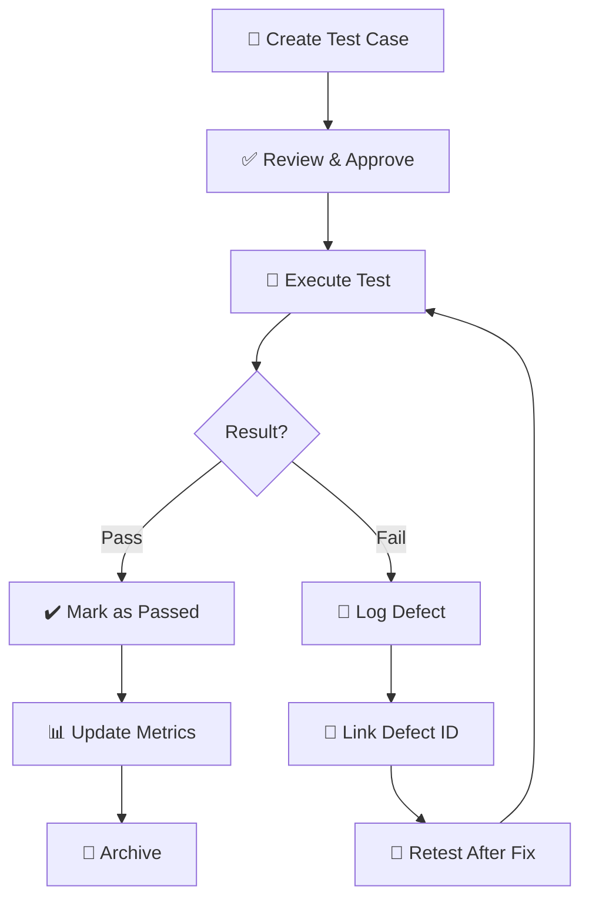

# 🧾 Test Case Template


> **A comprehensive, standardized template for writing clear, consistent, and executable test cases that improve quality and team efficiency.**

---

## 📑 Table of Contents

- [Overview](#-overview)
- [Test Case Workflow](#-test-case-workflow)
- [Test Case Header](#-test-case-header)
- [Environment Details](#-environment-details)
- [Preconditions](#-preconditions)
- [Test Steps](#-test-steps)
- [Test Data](#-test-data)
- [Expected Result](#-expected-result)
- [Actual Result](#-actual-result)
- [Test Status](#-test-status)
- [Execution Metrics](#-execution-metrics)
- [Attachments](#-attachments)
- [Defect Tracking](#-defect-tracking)
- [Comments / Notes](#-comments--notes)
- [Post-Conditions & Cleanup](#-post-conditions--cleanup)
- [Related Test Cases](#-related-test-cases)
- [Best Practices](#-best-practices-for-writing-test-cases)
- [Sample Test Cases](#-sample-test-cases)
- [Version History](#-version-history)
- [Contributing](#-contributing)

---

## 🎯 Overview

This document provides a **standardized template** for writing **clear, consistent, and executable** test cases.

### Benefits of Well-Written Test Cases:

✅ Improve test execution efficiency  
✅ Reduce ambiguity and confusion  
✅ Help new team members understand the system quickly  
✅ Serve as reliable documentation  
✅ Enable consistent regression testing  
✅ Facilitate test automation conversion  

> [!TIP]
> Use this template consistently across all projects to maintain quality standards and improve team collaboration.

---

## 🔄 Test Case Workflow



---

## 📌 Test Case Header

| Field | Description | Example |
|------|------------|---------|
| **Test Case ID** | Unique identifier following naming convention | `TC_LOGIN_001` |
| **Title** | Short, clear description of the test | `Verify login with valid credentials` |
| **Module** | Application module/feature under test | `Authentication` |
| **Requirement ID** | Linked requirement / user story / feature ID | `REQ-AUTH-101`, `US-123` |
| **Priority** | Test importance level | `Critical` / `High` / `Medium` / `Low` |
| **Test Type** | Category of testing | `Functional` / `Regression` / `Smoke` / `Sanity` / `Integration` |
| **Automation Status** | Can this be automated? | `Automated` / `Manual` / `Candidate for Automation` |
| **Author** | Test case creator | `John Doe` |
| **Reviewer** | Test case reviewer | `Jane Smith` |
| **Created Date** | Date of creation | `2026-02-06` |
| **Last Updated** | Date of last modification | `2026-02-06` |

> [!IMPORTANT]
> Always use a consistent naming convention for Test Case IDs. Format: `TC_[MODULE]_[NUMBER]`

---

## 🖥️ Environment Details

Specify the **test environment configuration** to ensure reproducibility.

| Field | Description | Example |
|------|------------|---------|
| **Environment** | Testing environment name | `QA`, `Staging`, `Pre-Prod` |
| **URL/Endpoint** | Application URL or API endpoint | `https://qa.example.com` |
| **OS** | Operating system | `Windows 11`, `macOS Sonoma`, `Ubuntu 22.04` |
| **Browser** | Browser and version (if web app) | `Chrome 121`, `Firefox 122`, `Safari 17` |
| **Device** | Device type (if mobile app) | `iPhone 14 Pro`, `Samsung Galaxy S23` |
| **App Version** | Application version under test | `v2.5.3` |
| **Database** | Database version and configuration | `PostgreSQL 15.2` |
| **Test Data Set** | Dataset being used | `Dataset_v1.2` |

> [!NOTE]
> Environment details help reproduce issues and track environment-specific behaviors.

---

## 🧪 Preconditions

Describe any **required setup** before executing the test.

### ✅ System Preconditions:
- [ ] Application is deployed and accessible
- [ ] Required services are running (database, APIs, etc.)
- [ ] Test environment is stable

### ✅ Data Preconditions:
- [ ] User account exists in the system
- [ ] Test data is loaded
- [ ] Database is in expected state

### ✅ User Preconditions:
- [ ] User has necessary permissions
- [ ] User is logged out (for login tests)
- [ ] Browser cache is cleared

**Example:**
```
- User account with email "testuser@example.com" exists
- User password is "P@ssw0rd123"
- User account status is "Active"
- No active sessions exist for this user
```

> [!WARNING]
> If preconditions are not met, test execution may fail or produce unreliable results.

---

## 🔁 Test Steps

Write **clear, sequential steps** that anyone can follow.

| Step No | Action | Input Data | Expected Behavior |
|---------|--------|-----------|-------------------|
| 1 | Navigate to application URL | `https://app.example.com` | Application home page loads |
| 2 | Click on "Login" button | - | Login page is displayed |
| 3 | Enter username in username field | `testuser@example.com` | Username is accepted |
| 4 | Enter password in password field | `P@ssw0rd123` | Password is masked |
| 5 | Click "Sign In" button | - | Login attempt is initiated |

### Guidelines for Writing Steps:
- Use **action verbs**: Click, Enter, Select, Verify
- Be **specific**: "Click 'Submit' button" not "Click button"
- Include **wait conditions** if needed: "Wait for page to load"
- Number steps sequentially
- Keep one action per step

---

## 🧩 Test Data

Specify the **input data** required for execution with validity status.

| Data Type | Field Name | Value | Validity | Notes |
|----------|-----------|-------|----------|-------|
| Username | `email` | `testuser@example.com` | ✅ Valid | Existing active user |
| Password | `password` | `P@ssw0rd123` | ✅ Valid | Meets password policy |
| Session Token | `auth_token` | - | N/A | Generated during test |

### Test Data Categories:

**Positive Test Data:**
```json
{
  "username": "valid_user@example.com",
  "password": "ValidP@ss123",
  "remember_me": true
}
```

**Negative Test Data:**
```json
{
  "username": "invalid@example.com",
  "password": "WrongPassword",
  "expected_error": "Invalid credentials"
}
```

> [!TIP]
> Maintain separate test data sets for positive, negative, and boundary value testing.

---

## ✅ Expected Result

Describe the **expected system behavior** after executing the test steps.

### Success Criteria:

**Functional:**
- User is successfully authenticated
- User session is created
- User is redirected to the dashboard page

**UI/UX:**
- Welcome message displays user's name
- Navigation menu is visible
- No error messages are shown

**Technical:**
- HTTP Status Code: `200 OK`
- Session cookie is set
- Last login timestamp is updated

**Example:**
```
After clicking "Sign In", user should be:
1. Authenticated successfully
2. Redirected to URL: https://app.example.com/dashboard
3. Greeted with message: "Welcome, Test User!"
4. Session timeout set to 30 minutes
```

---

## 📊 Actual Result

Capture the **observed system behavior** during execution.

### Execution Record:

**Date/Time:** `2026-02-06 10:30:45 IST`  
**Executed By:** `Ghanendra Kumar`  
**Build Version:** `v2.5.3-build-456`

**Observed Behavior:**
```
✅ User authenticated successfully
✅ Redirected to dashboard at https://app.example.com/dashboard
✅ Welcome message displayed: "Welcome, Test User!"
✅ Session cookie "session_id" created with 30min expiry
✅ Last login timestamp updated in database
```

**Deviation from Expected (if any):**
```
None - Test executed as expected
```

---

## 🧾 Test Status

Track the **execution status** of the test case.

- [ ] **Not Executed** - Test not yet run
- [ ] **In Progress** - Test execution ongoing
- [x] **Pass** - Test passed all validations
- [ ] **Fail** - Test failed one or more validations
- [ ] **Blocked** - Cannot execute due to blocker
- [ ] **Skipped** - Intentionally not executed
- [ ] **On Hold** - Temporarily paused

### Status Details:

| Status | Icon | Description |
|--------|------|-------------|
| Pass | ✅ | All expected results matched actual results |
| Fail | ❌ | At least one expected result did not match |
| Blocked | 🚫 | Cannot execute due to dependency or environment issue |
| Not Executed | ⏸️ | Test has not been run yet |
| Skipped | ⏭️ | Test intentionally bypassed (e.g., out of scope) |

**Current Status:** ✅ **PASS**

> [!CAUTION]
> If status is "Fail", always log a defect and link it in the Defect Tracking section.

---

## ⏱️ Execution Metrics

Track **performance and efficiency** metrics.

| Metric | Value | Notes |
|--------|-------|-------|
| **Execution Time** | `45 seconds` | Time taken to complete all steps |
| **Execution Date** | `2026-02-06` | When test was executed |
| **Execution Cycle** | `Sprint 12 - Regression` | Testing phase/cycle |
| **Iterations** | `1` | Number of times executed |
| **Pass Rate** | `100%` | (Passes / Total Executions) × 100 |
| **First Time Pass** | `Yes` | Passed on first execution? |
| **Automation Time Saved** | `N/A` | If automated |

---

## 📎 Attachments

Attach **supporting evidence** to validate test execution.

### 📸 Screenshots:
- `login_page_initial.png` - Login page before entering credentials
- `dashboard_after_login.png` - Dashboard after successful login
- `session_cookie_validation.png` - Browser dev tools showing session

### 🎥 Screen Recordings:
- `login_flow_recording.mp4` - Complete login flow execution

### 📄 Logs:
- `application_logs.txt` - Application console logs
- `network_logs.har` - Network traffic capture
- `database_query_logs.sql` - Database queries executed

### 📊 Reports:
- `performance_metrics.json` - Performance data
- `accessibility_scan.html` - Accessibility audit results

> [!TIP]
> Always attach screenshots for failed tests showing the exact point of failure.

---

## 🐛 Defect Tracking

Link **associated defects** if test fails.

| Defect ID | Summary | Status | Severity | Assigned To | Link |
|-----------|---------|--------|----------|-------------|------|
| `BUG-1234` | Login timeout on slow network | `Open` | `Medium` | Dev Team | [View Defect](#) |
| - | - | - | - | - | - |

### Defect Details Template:
```
Defect ID: BUG-XXXX
Title: [Brief description]
Steps to Reproduce: [Reference test steps]
Expected: [From this test case]
Actual: [What happened instead]
Severity: Critical/High/Medium/Low
Environment: [From Environment Details section]
Attachments: [Screenshots/logs from this test]
```

---

## 📝 Comments / Notes

Add any **additional observations** or important information.

### Testing Notes:
- Login works consistently across all supported browsers
- Performance is optimal with response time < 2 seconds
- No console errors observed during execution

### Known Limitations:
- Single Sign-On (SSO) flow not covered in this test
- Multi-factor authentication disabled in test environment

### Follow-up Actions:
- [ ] Create automation script for this test case
- [ ] Add negative test cases for invalid credentials
- [ ] Test with expired password scenario

### Environment-Specific Behavior:
- QA environment uses mock email service
- Production uses real email notifications

> [!NOTE]
> These notes help future testers understand context and edge cases.

---

## 🧹 Post-Conditions & Cleanup

Describe **system state after test** and required **cleanup steps**.

### Expected System State After Test:
- User session is active
- User is logged in
- Session cookie exists in browser
- Login timestamp recorded in database

### Cleanup Steps:
1. **Logout** from the application
2. **Clear browser cookies** and cache
3. **Verify session is terminated** in database
4. **Reset test data** if modified

**Cleanup Commands:**
```bash
# Clear test user session
DELETE FROM sessions WHERE user_id = 'test_user_123';

# Reset login attempt counter
UPDATE users SET failed_login_attempts = 0 WHERE email = 'testuser@example.com';
```

> [!IMPORTANT]
> Always perform cleanup to maintain test environment integrity and avoid data pollution.

---

## 🔗 Related Test Cases

Link to **dependent or related** test cases.

| Test Case ID | Title | Relationship | Status |
|--------------|-------|--------------|--------|
| `TC_LOGIN_002` | Verify login with invalid credentials | Alternative Flow | ✅ Pass |
| `TC_LOGIN_003` | Verify password reset flow | Related Feature | ⏸️ Not Executed |
| `TC_LOGOUT_001` | Verify logout functionality | Sequential Test | ✅ Pass |
| `TC_SESSION_001` | Verify session timeout | Related Feature | ✅ Pass |

### Dependencies:
- **Prerequisite Tests:** None
- **Following Tests:** `TC_LOGOUT_001` should be executed after this test

---

## 🧠 Best Practices for Writing Test Cases

### ✅ DO:
- ✔️ Write clear, concise, and unambiguous steps
- ✔️ Focus on one validation per test case
- ✔️ Use consistent naming conventions
- ✔️ Include both positive and negative scenarios
- ✔️ Add boundary value tests
- ✔️ Keep test cases independent (avoid dependencies)
- ✔️ Update test cases when requirements change
- ✔️ Include sufficient test data
- ✔️ Add verification steps explicitly

### ❌ DON'T:
- ✖️ Don't make assumptions about preconditions
- ✖️ Don't skip validation steps
- ✖️ Don't create dependent test chains
- ✖️ Don't use vague language like "check if works"
- ✖️ Don't leave out error scenarios
- ✖️ Don't forget to update test cases after changes

### 🎯 Quality Checklist:

Before finalizing a test case, verify:

- [ ] **Clarity:** Can someone unfamiliar execute this test?
- [ ] **Completeness:** Are all steps and data included?
- [ ] **Consistency:** Does it follow team standards?
- [ ] **Traceability:** Is it linked to requirements?
- [ ] **Maintainability:** Will it be easy to update?
- [ ] **Reusability:** Can it be used in regression?

---

## 📋 Sample Test Cases

### Example 1: Positive Test Case (Detailed)

**Test Case ID:** `TC_LOGIN_001`  
**Title:** Verify successful login with valid credentials  
**Module:** Authentication  
**Requirement ID:** `REQ-AUTH-101`  
**Priority:** Critical  
**Test Type:** Functional, Smoke  
**Automation Status:** Automated  
**Author:** Ghanendra Kumar  
**Created Date:** 2026-02-06  

**Environment:**
- **URL:** `https://qa.example.com`
- **Browser:** Chrome 121
- **OS:** macOS Sonoma

**Preconditions:**  
✅ User account exists with email: `testuser@example.com`  
✅ User account is active  
✅ User is currently logged out  

**Test Steps:**
| Step | Action | Input | Expected |
|------|--------|-------|----------|
| 1 | Navigate to login page | `https://qa.example.com/login` | Login form displayed |
| 2 | Enter email address | `testuser@example.com` | Email field accepts input |
| 3 | Enter password | `P@ssw0rd123` | Password is masked |
| 4 | Click "Sign In" button | - | Login initiated |

**Expected Result:**  
- User authenticated successfully
- Redirected to `/dashboard`
- Welcome message: "Welcome back, Test User!"
- Session cookie created

**Actual Result:**  
✅ All expected results achieved

**Status:** ✅ Pass  
**Execution Time:** 45 seconds  
**Executed By:** Ghanendra Kumar  
**Execution Date:** 2026-02-06  

---

### Example 2: Negative Test Case

**Test Case ID:** `TC_LOGIN_002`  
**Title:** Verify login fails with invalid password  
**Priority:** High  
**Test Type:** Negative Testing  

**Preconditions:**  
User account exists: `testuser@example.com`

**Test Data:**
- Email: `testuser@example.com` (Valid)
- Password: `WrongPassword123` (Invalid)

**Test Steps:**
1. Navigate to login page
2. Enter valid email: `testuser@example.com`
3. Enter invalid password: `WrongPassword123`
4. Click "Sign In"

**Expected Result:**  
- ❌ Login fails
- Error message: "Invalid email or password"
- User remains on login page
- No session created

**Status:** ✅ Pass (correctly rejected invalid credentials)

---

### Example 3: Boundary Test Case

**Test Case ID:** `TC_LOGIN_005`  
**Title:** Verify account lockout after maximum failed attempts  
**Priority:** High  
**Test Type:** Security, Boundary Testing  

**Preconditions:**  
- Account lockout policy: 5 failed attempts
- User account is active and unlocked

**Test Steps:**
1. Attempt login with wrong password (Attempt 1/5)
2. Attempt login with wrong password (Attempt 2/5)
3. Attempt login with wrong password (Attempt 3/5)
4. Attempt login with wrong password (Attempt 4/5)
5. Attempt login with wrong password (Attempt 5/5)
6. Verify account is locked
7. Attempt login with correct password

**Expected Result:**  
- After 5th failed attempt: Account locked
- Error message: "Account locked due to multiple failed attempts"
- Cannot login even with correct password
- Account unlock after 30 minutes

**Status:** ✅ Pass

---

## 📊 Version History

| Version | Date | Author | Changes |
|---------|------|--------|---------|
| 2.0 | 2026-02-06 | Ghanendra Kumar | Enhanced with GitHub beautification, added metrics, diagrams, alerts |
| 1.5 | 2026-01-15 | QA Team | Added automation status and environment details |
| 1.0 | 2025-11-01 | QA Team | Initial template creation |

---

## 🤝 Contributing

We welcome contributions to improve this template!

### How to Contribute:
1. 🍴 Fork this repository
2. 🌿 Create a feature branch (`git checkout -b feature/improvement`)
3. ✏️ Make your changes
4. ✅ Ensure changes follow the template structure
5. 📝 Update version history
6. 🚀 Submit a pull request

### Contribution Guidelines:
- Keep the template generic and reusable
- Follow Markdown best practices
- Add examples for new sections
- Update table of contents if adding sections

---

## 📬 Support & Contact

- 📧 **Email:** support@qa-team.example.com
- 💬 **Slack:** #qa-automation
- 📚 **Documentation:** [Wiki Link]
- 🐛 **Report Issues:** [Issue Tracker]

---

## 📄 License

This template is licensed under the **MIT License**.

```
MIT License - Copyright (c) 2026 QA Team

Permission is hereby granted, free of charge, to use, copy, modify, merge, 
publish, distribute, sublicense, and/or sell copies of this template.
```

---

## 🎓 Additional Resources

- 📖 [ISTQB Testing Principles](https://www.istqb.org/)
- 🎯 [Test Case Design Techniques](https://www.guru99.com/test-case.html)
- 🔧 [Test Management Tools Comparison](https://www.softwaretestinghelp.com/)
- 🤖 [Test Automation Best Practices](https://testautomationuniversity.com/)

---

### ▶️ Next Steps

**Continue Learning:**
1. 📝 Review `sample-test-cases.md` for more practical examples
2. 🧪 Practice writing test cases using this template
3. 🔄 Execute test cases and track results
4. 🤖 Explore test automation frameworks
5. 📊 Learn test management tools (Jira, TestRail, Zephyr)

---

<div align="center">

**⭐ If you found this template helpful, please star this repository! ⭐**

Made with ❤️ by the QA Team | Last Updated: February 2026

</div>
