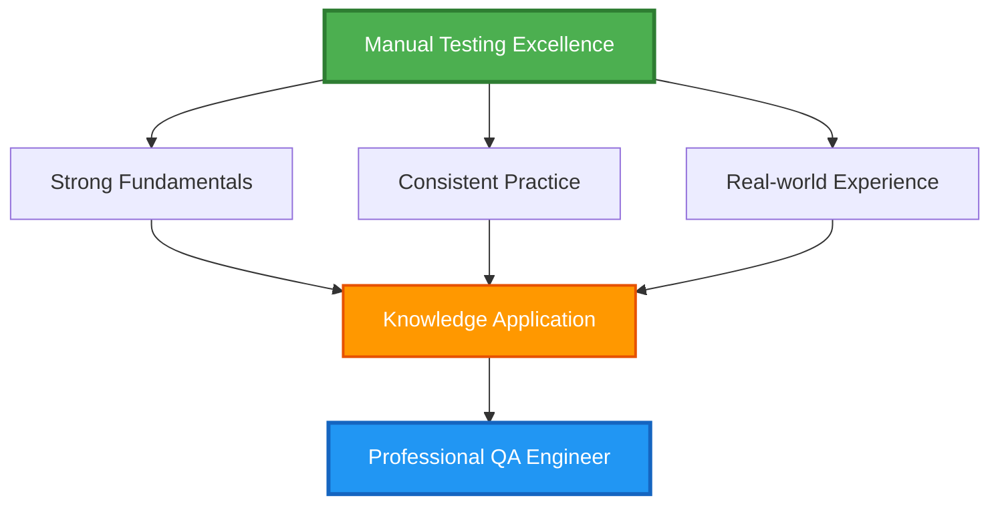

# 📚 Manual Testing – Learning Resources

---

## 📋 Overview

This section contains a **curated list of high-quality resources** to strengthen **manual testing fundamentals**, testing mindset, and professional QA practices.

> [!IMPORTANT]
> The goal is **quality over quantity** — each resource listed here adds real value and complements the hands-on exercises in this repository.

---

## 🎯 Purpose of This Section

These resources will help you:

- ✅ **Reinforce** manual testing concepts
- 🌍 **Understand** real-world QA practices
- 🧠 **Build** testing intuition and analytical thinking
- 💼 **Prepare** for interviews and certifications
- 👨‍🏫 **Learn** from industry experts

---

## 📌 Table of Contents

| # | Topic | Description |
|---|-------|-------------|
| 1️⃣ | [Foundational Concepts](#1️⃣-foundational-concepts) | Core testing principles and basics |
| 2️⃣ | [Black Box Testing Techniques](#2️⃣-black-box-testing-techniques) | Testing techniques for effective coverage |
| 3️⃣ | [Test Case Design & Documentation](#3️⃣-test-case-design--documentation) | Writing and maintaining test cases |
| 4️⃣ | [Bug Reporting & Defect Management](#4️⃣-bug-reporting--defect-management) | Effective defect tracking and communication |
| 5️⃣ | [Exploratory Testing](#5️⃣-exploratory-testing) | Ad-hoc and session-based testing |
| 6️⃣ | [Testing Process & QA Mindset](#6️⃣-testing-process--qa-mindset) | Professional QA practices and approaches |
| 7️⃣ | [Certification & Interview Preparation](#7️⃣-certification--interview-preparation) | Career advancement resources |

---

## 1️⃣ Foundational Concepts

<strong>📖 Articles & Blogs</strong>

- 📘 **ISTQB Foundation Level Syllabus** (official)
- 📗 **Software Testing Fundamentals** – Guru99
- 📙 **Testing Basics** – Ministry of Testing

<strong>🎥 Videos</strong>

- 🎬 **Software Testing Introduction** (YouTube – beginner-friendly playlists)
- 🎬 **SDLC & STLC explained** (industry walkthroughs)

---

## 2️⃣ Black Box Testing Techniques

<strong>📖 Reading</strong>

- 📊 **Equivalence Partitioning & Boundary Value Analysis** – Guru99
- 📊 **Decision Table & State Transition Testing** – Software Testing Help

<strong>🧠 Practice</strong>

- 🎯 Online quizzes on black box testing techniques
- 🎯 Sample problems from ISTQB Foundation resources

---

## 3️⃣ Test Case Design & Documentation

<strong>📖 Reading</strong>

- ✍️ **How to write effective test cases** – Software Testing Help
- ✍️ **Test case design best practices** – Ministry of Testing

<strong>🧾 Templates</strong>

- 📄 Test case templates (Excel / Google Sheets)
- 📄 Requirement Traceability Matrix (RTM) examples

---

## 4️⃣ Bug Reporting & Defect Management

<strong>📖 Reading</strong>

- 🐛 **How to write a good bug report** – Atlassian
- 🐛 **Defect life cycle explained** – Guru99

<strong>🧠 Best Practices</strong>

> [!TIP]
> Follow these golden rules for effective bug reporting:
> 
> - ✅ **One defect per ticket**
> - 📝 **Clear steps to reproduce**
> - 📸 **Always attach evidence**

---

## 5️⃣ Exploratory Testing

<strong>📖 Reading</strong>

- 🔍 **Introduction to Exploratory Testing** – Ministry of Testing
- 🔍 **Session-Based Test Management (SBTM)**

<strong>🎥 Videos</strong>

- 🎬 Exploratory Testing explained with examples
- 🎬 Live exploratory testing demos

---

## 6️⃣ Testing Process & QA Mindset

<strong>📖 Reading</strong>

- 🎓 **QA vs Testing** – roles & responsibilities
- 🎓 **Agile testing principles**
- 🎓 **Shift-left testing approach**

<strong>🧠 Thought Leadership</strong>

- 💭 Blogs by experienced QA professionals
- 💭 Testing heuristics and checklists

---

## 7️⃣ Certification & Interview Preparation

<strong>📘 Certifications</strong>

- 🏆 **ISTQB Foundation Level** (concept reference only)
- 🏆 Sample ISTQB question banks

<strong>🧠 Interview Prep</strong>

- 💼 Common manual testing interview questions
- 💼 Real-world scenario-based questions
- 💼 Testing puzzles and problem-solving exercises

---

## 🧠 How to Use These Resources

> [!NOTE]
> Strategic learning approach for maximum effectiveness:

- 🚫 Do **not** try to consume everything at once
- 🎯 Use resources to **clarify doubts**
- 🔄 Revisit when concepts feel unclear
- 🤝 Combine reading with **hands-on practice**

> [!TIP]
> **Strong testers don't memorize — they understand and apply.**

---

## 🎓 Conclusion

Manual testing excellence comes from:

> [!IMPORTANT]
> These resources support your journey, but **your thinking and observation skills** will define your growth.

---

## 🚀 Next Step

### ▶️ Ready to move forward?

Proceed to: **`2_api_testing_manual_and_automation/README.md`**  
to begin learning **API testing concepts and practices**.

---

**[⬆ Back to Top](#-manual-testing--learning-resources)** | **[🏠 Main README](../../README.md)**

Made with ❤️ for QA Engineers | 100% Free Education

