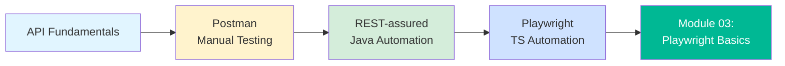

<div align="center">

# 🔌 API Testing — Manual & Automation


**Everything below the UI is an API call. If you can't test that, you're only testing the paint job.**

</div>

---

## 📑 Table of Contents

- [Why This Module Exists](#-why-this-module-exists)
- [What You'll Learn](#-what-youll-learn)
- [Learning Path](#-learning-path)
- [API Fundamentals](#-api-fundamentals-read-this-first)
- [The Three Examples](#-the-three-examples-in-this-folder)
- [Real-World Connection](#-real-world-connection)
- [Practice Exercise](#-practice-exercise)
- [Best Practices](#-best-practices)
- [Next Steps](#-next-steps)

---

## 🎯 Why This Module Exists

A UI test clicks a button and waits for something to render. It's slow, it's flaky, and if the
button is one pixel off, the test fails for a reason that has nothing to do with whether the
feature actually works.

An API test skips the pixels and asks the real question: **did the server do the right thing?**

> [!IMPORTANT]
> Every serious test automation framework is API-heavy underneath, even the ones that look like
> pure UI frameworks. You'll use API calls constantly in later modules — not just to test APIs
> directly, but to set up test data ("create a user via API in 200ms" beats "click through a
> 6-screen signup form for the 50th time").

---

## 🎓 What You'll Learn

- API fundamentals: REST, HTTP methods, status codes, request/response structure
- Manual API testing with **Postman** (no code required)
- Automated API testing with **REST-assured** (Java)
- Automated API testing with **Playwright** (TypeScript — the tool this repo standardizes on
  from Module 03 onward)
- How to read a status code like a detective, not a passenger

---

## 🧭 Learning Path



Do them **in this order**. Postman first because it removes code from the equation entirely —
you learn what a good API test even checks for before you learn how to type it in a language.
Then REST-assured, because seeing the same concepts in Java shows you what's fundamental
(status codes, assertions, schemas) versus what's tool-specific syntax. Then Playwright, because
that's the tool the rest of this repo runs on.

---

## 📖 API Fundamentals (Read This First)

If you've never tested an API before, here's the 5-minute version:

**HTTP Methods — what you're asking the server to do:**

| Method | Meaning | Real-World Analogy |
|--------|---------|---------------------|
| `GET` | Read data | "Show me my order history" |
| `POST` | Create data | "Place a new order" |
| `PUT` | Replace data entirely | "Redo this entire order form" |
| `PATCH` | Update part of the data | "Just change the shipping address" |
| `DELETE` | Remove data | "Cancel this order" |

**Status Codes — what the server is telling you back:**

| Range | Meaning | Example |
|-------|---------|---------|
| `2xx` | "It worked" | `200 OK`, `201 Created` |
| `3xx` | "Go look over there instead" | `301 Moved Permanently` |
| `4xx` | "You messed up" | `400 Bad Request`, `401 Unauthorized`, `404 Not Found` |
| `5xx` | "We messed up" | `500 Internal Server Error` |

> [!TIP]
> A **4xx** on a bad request is not a bug — it's the API doing its job. A **200 OK** on a bad
> request (server accepted garbage and pretended everything's fine) is a real bug people ship all
> the time. Testing that the API rejects bad input correctly is just as important as testing that
> it accepts good input.

**Real example — a payout API rejecting a duplicate transfer:**

```
POST /v1/payouts
{ "merchantId": "M1029", "amount": 5000, "idempotencyKey": "PO-2026-0417-01" }

First call  → 201 Created  (payout initiated)
Second call → 409 Conflict (duplicate idempotency key — payout NOT created twice)
```

That `409` is the entire reason idempotency keys exist in payment APIs — without it, a flaky
network retry could pay a merchant twice. Testing the *second* call's status code isn't an
edge case here; it's the actual point of the endpoint.

---

## 📂 The Three Examples in This Folder

| File | Tool | Language | Best For |
|------|------|----------|----------|
| [`examples/postman-api-testing-example.md`](./examples/postman-api-testing-example.md) | Postman | No-code / JS scripts | Learning what to test, fast |
| [`examples/rest-assured-api-testing-example.md`](./examples/rest-assured-api-testing-example.md) | REST-assured | Java | Java-based teams, BDD-style syntax |
| [`examples/playwright-api-testing-example.md`](./examples/playwright-api-testing-example.md) | Playwright | TypeScript | What you'll actually use from Module 03 onward |

All three test the same public practice API (`jsonplaceholder.typicode.com`) so you can compare
the exact same GET/POST/PUT/DELETE scenario across three tools and see how the *concepts* stay
identical while the *syntax* changes.

---

## 🌍 Real-World Connection

The examples above use a toy API on purpose — it's free, it's stable, and it doesn't require an
account. But the same GET/POST/status-code/schema-validation thinking is exactly what shows up in
production fintech APIs. A payout status endpoint isn't conceptually different from
`GET /posts/:id` — it's still "send a request, check the status code, validate the response
shape" — the difference is what's *at stake* when the assertion is wrong:

```
GET /posts/1         → wrong assertion = a blog post title is wrong on a test blog
GET /payouts/PO-1029 → wrong assertion = a merchant's money silently vanishes from a report
```

Same HTTP verb. Very different consequences of a lazy test. Keep that in mind as you work through
the examples — the muscle memory you build here (validate status, validate schema, validate the
field that actually matters) is the same muscle memory used to test a real settlement or refund
API later in this roadmap.

---

## ✍️ Practice Exercise

Before moving to Module 03, do this without looking at the examples first:

1. Pick a free public API you haven't used yet — [ReqRes](https://reqres.in/) or
   [RestfulAPI.dev](https://restful-api.dev/) both work.
2. In Postman, write tests for: a successful `GET`, a `GET` for a resource that doesn't exist
   (check you get a `404`, not a `200` with an empty body), a `POST` that creates something, and
   a `POST` with a missing required field (does the API actually validate it, or silently accept
   garbage?).
3. Write down, in your own words, what you'd tell a developer if the "missing required field"
   test came back `201 Created` instead of `400 Bad Request`.

That last question is the real skill. Anyone can copy-paste a `pm.test()` block. Knowing *why* a
`201` there is a bug — and being able to explain it in one sentence — is what separates "ran some
tests" from "tested the API."

---

## 🧠 Best Practices

**Do:**
- Test the unhappy path as hard as the happy path — missing fields, wrong types, huge payloads
- Validate the response **schema**, not just the status code — a `200` with the wrong shape is
  still a bug
- Use environment variables for base URLs and secrets — never hardcode a token in a test file
- Chain requests (create → read → update → delete) to test a full resource lifecycle, not just
  isolated calls

**Don't:**
- Trust a `200` status code alone — read the body
- Write tests that depend on a previous test's leftover data without cleaning up after themselves
- Skip authentication/authorization tests — "can user A see user B's data" is a real bug class,
  not a paranoid edge case

---

## 🎓 Next Steps

You now know what to test in an API and have seen it done three different ways. Next: stop
testing APIs directly and start driving a **browser** with Playwright — Module 03 is where you
write your first UI automation test.

**Next Module:** → [03-playwright-basics](../03-playwright-basics/)

---

<div align="center">

**[⬆ Back to Top](#-api-testing--manual--automation)** | **[🏠 Main README](../README.md)**

</div>
