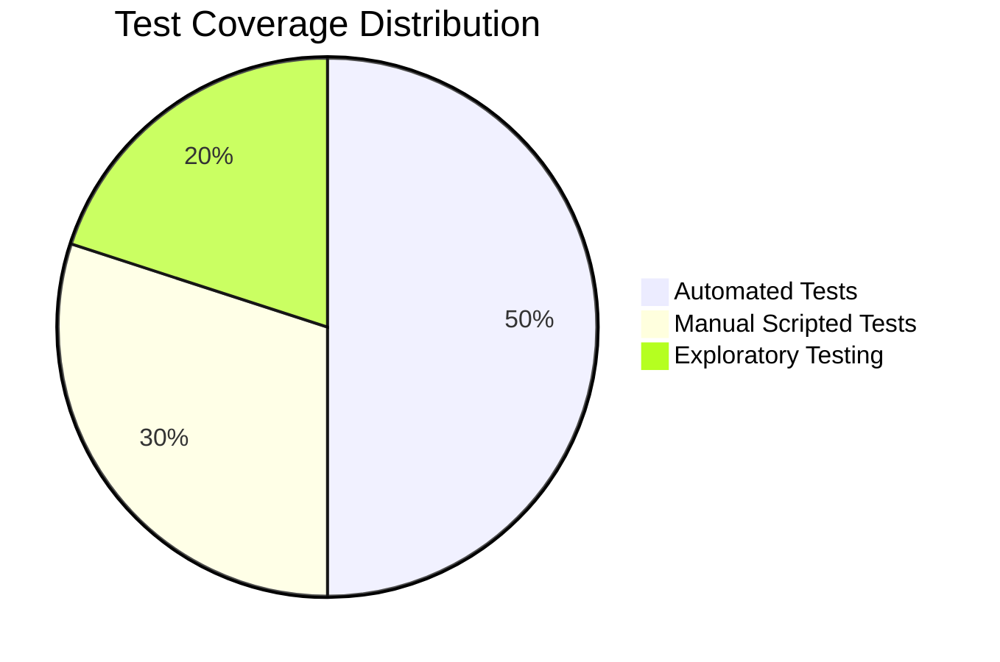
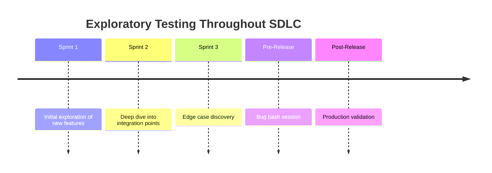
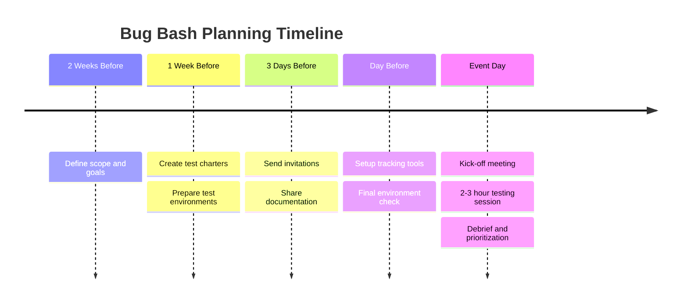

# 🔍 Exploratory Testing – Notes & Guidelines


> **A comprehensive guide to performing effective exploratory testing—the simultaneous process of learning, test design, and execution that uncovers defects missed by scripted testing.**

---

## 📑 Table of Contents

- [Overview](#-overview)
- [What is Exploratory Testing](#-what-is-exploratory-testing)
- [Why Exploratory Testing Matters](#-why-exploratory-testing-matters)
- [When to Perform Exploratory Testing](#-when-to-perform-exploratory-testing)
- [How to Perform Exploratory Testing](#-how-to-perform-exploratory-testing)
- [Test Charters](#-test-charters)
- [Time-Boxed Sessions](#-time-boxed-sessions)
- [Session Note Template](#-session-note-template)
- [Common Exploratory Techniques](#-common-exploratory-techniques)
- [Heuristics & Mnemonics](#-heuristics--mnemonics)
- [Bug Bash Guidelines](#-bug-bash-guidelines)
- [Documentation & Reporting](#-documentation--reporting)
- [Tools for Exploratory Testing](#-tools-for-exploratory-testing)
- [Common Mistakes to Avoid](#-common-mistakes-to-avoid)
- [Real-World Examples](#-real-world-examples)
- [Version History](#-version-history)

---

## 🎯 Overview

Exploratory testing is a **simultaneous process of learning, test design, and test execution**.  
Unlike scripted testing, it relies on **critical thinking, domain knowledge, and tester intuition**.

### Key Characteristics:

- 🧠 **Thinking-intensive**: Requires active engagement and critical analysis
- 🔄 **Iterative**: Tests evolve based on what you discover
- 📝 **Structured**: Not random—follows charters and heuristics
- 🎯 **Goal-oriented**: Focused on specific missions or areas
- ⏱️ **Time-boxed**: Sessions have defined duration

> [!IMPORTANT]
> Exploratory testing is **NOT** random testing. It is intentional, skilled, structured, and requires domain expertise.

---

## 🔍 What is Exploratory Testing

```mermaid
graph LR
    A[🧠 Learning] <--> B[📝 Test Design]
    B <--> C[🧪 Test Execution]
    C <--> A
    
    style A fill:#e1f5ff
    style B fill:#ffe1f5
    style C fill:#f5ffe1
```



### Exploratory testing is a testing approach where:

1. **Test Design** - Creating test ideas on the fly
2. **Test Execution** - Running tests immediately
3. **Test Learning** - Adapting based on observations

All happen **simultaneously and interactively**.

The tester actively explores the application, learns its behavior, and adapts testing strategy based on real-time observations.

### Types of Exploratory Testing:

| Type | Description | Best For |
|------|-------------|----------|
| **Freestyle** | Completely unstructured exploration | Quick sanity checks |
| **Scenario-based** | Follow user scenarios | User journey validation |
| **Strategy-based** | Use specific testing heuristics | Systematic coverage |
| **Session-based** | Time-boxed with charters | Structured exploration |

---

## 💡 Why Exploratory Testing Matters

### Benefits:

✅ **Finds edge cases** not covered by scripted test cases  
✅ **Discovers usability issues** through real user interaction  
✅ **Detects integration gaps** and workflow problems  
✅ **Uncovers real user behavior issues** missed by automation  
✅ **Provides quick feedback** early in development  
✅ **Adapts to changing requirements** without rewriting tests  
✅ **Leverages tester expertise** and domain knowledge  

### Complements Other Testing:



> [!TIP]
> Exploratory testing is most effective when combined with automated regression tests and scripted test cases to achieve comprehensive coverage.

---

## 📅 When to Perform Exploratory Testing

Exploratory testing is especially effective in these scenarios:

### ✅ Ideal Scenarios:

| Scenario | Rationale |
|----------|-----------|
| **Requirements are unclear or evolving** | Flexibility to adapt without rewriting test cases |
| **Early stages of development** | Quick feedback before formal test cases exist |
| **After new feature release** | Discover integration issues and edge cases |
| **Before major releases** | Final validation beyond scripted tests |
| **Limited time available** | Maximum coverage with minimal preparation |
| **New team member onboarding** | Hands-on learning of the application |
| **After production incidents** | Investigate similar risk areas |

### Development Lifecycle Integration:



---

## 🚀 How to Perform Exploratory Testing

### Step-by-Step Process:

```mermaid
flowchart TD
    A[📚 Understand the Feature] --> B[🎯 Define Test Mission/Charter]
    B --> C[⏱️ Set Time Box]
    C --> D[🔍 Explore & Observe]
    D --> E[📝 Take Notes]
    E --> F{Issues Found?}
    F -->|Yes| G[🐛 Log Defects]
    F -->|No| H[✅ Document Coverage]
    G --> H
    H --> I{Time Remaining?}
    I -->|Yes| D
    I -->|No| J[📊 Create Session Report]
```



---

### **Step 1: Understand the Feature**

Before exploring, gain context:

- 📖 Read available requirements or user stories
- 🎯 Identify the feature's purpose and goals
- 👥 Understand expected user behavior
- 🔗 Note dependencies and integrations
- ⚠️ Review known limitations or constraints

**Example Questions:**
- What problem does this feature solve?
- Who are the primary users?
- What are the critical workflows?
- What could go wrong?

---

### **Step 2: Define a Test Mission (Charter)**

A **test charter** gives direction and focus to your session.

**Charter Format:**
```
Explore [AREA]
With [RESOURCES]
To discover [INFORMATION]
```

**Examples:**

| Charter | Focus Area |
|---------|-----------|
| Explore **login error handling** with **invalid credentials** to discover **security vulnerabilities** | Security |
| Explore **form validations** with **boundary values** to discover **data handling issues** | Validation |
| Explore **payment failure scenarios** with **different payment methods** to discover **error handling gaps** | Integration |
| Explore **mobile responsiveness** with **various screen sizes** to discover **UI/UX issues** | UI/UX |

---

### **Step 3: Explore and Observe**

Apply various testing techniques:

- 🟢 **Positive flows**: Normal user journeys
- 🔴 **Negative flows**: Invalid inputs, edge cases
- 🔄 **Workflow variations**: Different sequences
- ⚡ **Performance observations**: Response times, loading
- 🎨 **UI/UX evaluation**: Clarity, accessibility
- 🔗 **Integration points**: Data flow between systems

**Exploration Techniques:**
- Click everything clickable
- Try unexpected input combinations
- Test boundary values
- Interrupt workflows mid-process
- Use browser back/forward buttons
- Test with different user roles

---

### **Step 4: Take Notes**

Document continuously during exploration:

**What to Capture:**
- ✍️ Observations and behaviors
- 🐛 Issues and anomalies found
- ❓ Questions for clarification
- 💡 Test ideas for automation
- 📊 Coverage areas explored
- ⏱️ Time spent on each area

> [!NOTE]
> Use tools like OneNote, Evernote, or specialized exploratory testing tools (Rapid Reporter, Session Tester) to capture notes efficiently.

---

## 🎯 Test Charters

### Charter Template:

```markdown
## Test Charter: [Charter Name]

**Mission:**  
Explore [AREA] with [RESOURCES/TOOLS] to discover [TARGET INFORMATION]

**Duration:** [Planned time, e.g., 60 minutes]

**Scope:**
- ✅ In Scope: [What to test]
- ❌ Out of Scope: [What not to test]

**Test Data Required:**
- [List test data/accounts needed]

**Environment:**
- [Env name, URL, credentials]

**Areas to Explore:**
1. [Area 1]
2. [Area 2]
3. [Area 3]

**Risks to Investigate:**
- [Known risk areas or concerns]

**Related Requirements:**
- [REQ-XXX, User Story links]
```

### Example Charter:

```markdown
## Test Charter: Login Authentication Security

**Mission:**  
Explore login authentication with various attack vectors to discover security vulnerabilities

**Duration:** 90 minutes

**Scope:**
- ✅ In Scope: Login form, password reset, account lockout
- ❌ Out of Scope: Registration, social login (OAuth)

**Test Data Required:**
- Valid user account: testuser@example.com
- Locked account: locked@example.com
- Admin account: admin@example.com

**Environment:**
- QA Environment: https://qa.example.com

**Areas to Explore:**
1. SQL injection attempts
2. XSS in username/password fields
3. Brute force attack resistance
4. Session token security
5. Password exposure in network logs

**Risks to Investigate:**
- Account enumeration vulnerability
- Weak password policy enforcement
- Missing rate limiting
```

---

## ⏱️ Time-Boxed Sessions

Exploratory testing should be **time-boxed** to maintain focus and productivity.

### Recommended Durations:

| Session Type | Duration | Best For |
|-------------|----------|----------|
| **Quick Exploration** | 15-30 minutes | Sanity checks, smoke testing |
| **Standard Session** | 45-90 minutes | Feature testing, charter-based |
| **Deep Dive** | 2-3 hours | Complex features, integration |
| **Bug Bash** | 2-4 hours | Team-wide exploration event |

### Session Structure:

```mermaid
gantt
    title 90-Minute Exploratory Session
    dateFormat mm
    section Setup
    Review charter      :00, 5m
    Prepare environment :05, 5m
    section Exploration
    Initial exploration :10, 30m
    Deep investigation  :40, 30m
    Edge case testing   :70, 15m
    section Wrap-up
    Document findings   :85, 5m
```



> [!WARNING]
> Avoid sessions longer than 2 hours without breaks-—tester fatigue reduces effectiveness.

---

## 📋 Session Note Template

### Session Report Template:

```markdown
# Exploratory Testing Session Report

## Session Details
- **Session ID:** ET-2026-02-08-001
- **Tester:** [Your Name]
- **Date:** 2026-02-08
- **Duration:** 90 minutes (10:00 AM - 11:30 AM)
- **Build Version:** v2.5.3-beta

## Charter
Explore [AREA] with [RESOURCES] to discover [INFORMATION]

## Scope
**Covered:**
- [x] Login with valid credentials
- [x] Login with invalid password
- [x] Account lockout mechanism

**Not Covered:**
- [ ] Password reset (separate charter)
- [ ] Social login integration

## Test Data Used
- Email: testuser@example.com
- Password: Test@1234
- Environment: QA (https://qa.example.com)

## Findings

### 🐛 Defects Found: 3

| ID | Severity | Summary | Status |
|----|----------|---------|--------|
| BUG-456 | High | Account not locked after 5 failed attempts | Logged |
| BUG-457 | Medium | Error message reveals if email exists | Logged |
| BUG-458 | Low | Remember me checkbox not working | Logged |

### ✅ Positive Observations: 2
- Login response time consistently < 1 second
- Clear error messages for validation failures

### ❓ Questions Raised: 1
- Should password reset link expire after 24 hours? (Not documented)

### 💡 Test Automation Ideas: 2
- Automate account lockout scenario
- Validate login API performance under load

## Coverage Metrics
- **Time Distribution:**
  - Positive scenarios: 30 min (33%)
  - Negative scenarios: 45 min (50%)
  - Documentation: 15 min (17%)

- **Test Types:**
  - Functional: 70%
  - Security: 20%
  - UI/UX: 10%

## Risk Assessment
- 🔴 **High Risk:** Account enumeration vulnerability
- 🟡 **Medium Risk:** Weak error messaging
- 🟢 **Low Risk:** Minor UI inconsistencies

## Follow-up Actions
- [ ] Log all defects in Jira
- [ ] Create automated tests for critical flows
- [ ] Schedule security-focused session next week
- [ ] Clarify password reset policy with PM

## Notes
- Testing was smooth, no environment issues
- Feature ready for regression testing after bug fixes
```

---

## 🔧 Common Exploratory Techniques

### 1️⃣ Error Guessing

Use experience and intuition to predict where defects might exist.

**Common Error-Prone Areas:**
- ❌ Invalid or unexpected inputs
- ❌ Boundary conditions
- ❌ Null/empty values
- ❌ Special characters
- ❌ Very large or very small data volumes
- ❌ Race conditions (concurrent actions)
- ❌ Network failures/timeouts

**Example:** Testing a search feature with:
- Empty search query
- 1000-character search string
- SQL injection payloads
- Unicode characters
- Special symbols (@#$%&*)

---

### 2️⃣ Boundary & Negative Testing

Test at the edges of acceptable ranges.

| Field | Min Boundary | Max Boundary | Below Min | Above Max |
|-------|-------------|-------------|-----------|-----------|
| Age (18-60) | 18 ✅ | 60 ✅ | 17 ❌ | 61 ❌ |
| Password (8-16) | 8 chars ✅ | 16 chars ✅ | 7 chars ❌ | 17 chars ❌ |
| Upload (< 5MB) | 1KB ✅ | 4.9MB ✅ | 0 bytes ❌ | 6MB ❌ |

---

### 3️⃣ Workflow Testing

**Test user journeys end-to-end:**
- ✅ Complete happy path workflows
- 🔄 Interrupted workflows (browser close mid-process)
- ⬅️ Back button navigation
- 🔀 Alternative paths to same goal
- 🔁 Repeated actions

**Example Workflow:** E-commerce Checkout
1. Browse → Add to Cart → Checkout → Payment → Confirmation
2. Add to Cart → Browse → Checkout (interrupted flow)
3. Checkout → Back → Modify Cart → Checkout (navigation)

---

### 4️⃣ UI & Usability Testing

Evaluate user experience aspects:

- 🎨 **Visual Clarity**: Error messages clear and actionable?
- 🔘 **Button States**: Enabled/disabled states correct?
- 📐 **Alignment**: Elements properly aligned?
- ♿ **Accessibility**: Keyboard navigation, screen readers
- 📱 **Responsiveness**: Mobile/tablet layouts
- ⏳ **Loading States**: Spinners during async operations
- 🌐 **Localization**: Multi-language support

---

## 🧩 Heuristics & Mnemonics

### SFDPOT Heuristic

Classic heuristic for comprehensive coverage:

| Letter | Category | What to Test | Examples |
|--------|----------|--------------|----------|
| **S** | **Structure** | How app is built | Navigation, menus, page structure |
| **F** | **Function** | What app does | Features, calculations, workflows |
| **D** | **Data** | Information processed | Input/output, validation, storage |
| **P** | **Platform** | Environment | Browsers, OS, devices, networks |
| **O** | **Operations** | User interactions | Clicks, typing, gestures, shortcuts |
| **T** | **Time** | Temporal aspects | Timeouts, schedules, concurrency |

---

### FEW HICCUPPS Mnemonic

Quality criteria to evaluate:

| Letter | Quality Attribute | Testing Focus |
|--------|------------------|---------------|
| **F** | **Familiarity** | How intuitive is the interface? |
| **E** | **Explainability** | Are features self-explanatory? |
| **W** | **World Readiness** | Localization, accessibility, compliance |
| **H** | **History** | Past defects, known issues |
| **I** | **Image** | Brand consistency, visual quality |
| **C** | **Comparable Products** | How does it compare to competitors? |
| **C** | **Claims** | Does it meet marketing promises? |
| **U** | **Users** | Different user personas, roles |
| **P** | **Purpose** | Does it achieve its goals? |
| **P** | **Performance** | Speed, reliability, scalability |
| **S** | **Security** | Vulnerabilities, data protection |

---

### CRUD Heuristic

For data-driven applications:

- **C**reate - Add new records
- **R**ead - View/retrieve data
- **U**pdate - Modify existing data
- **D**elete - Remove data

Test all four operations for each entity.

---

## 🎉 Bug Bash Guidelines

A **bug bash** is a time-boxed team event for exploratory testing.

### Planning a Bug Bash:



### Event Structure:

**Duration:** 2-4 hours

| Phase | Duration | Activities |
|-------|----------|------------|
| **Kickoff** | 15 min | Explain goals, scope, charter distribution |
| **Exploration** | 2-3 hours | Team explores application, logs defects |
| **Breaks** | 15 min (every hour) | Rest, discuss findings |
| **Debrief** | 30 min | Review findings, prioritize defects |

### Roles:

- **Facilitator**: Organizes event, manages logistics
- **Testers**: All team members (QA, Dev, PM, Design)
- **Scribe**: Documents collective findings
- **Dev on Call**: Answers technical questions

### Tips for Successful Bug Bash:

1. ✅ **Provide clear charters** for focus areas
2. ✅ **Prepare test data** in advance
3. ✅ **Use shared defect tracker** (spreadsheet, Jira)
4. ✅ **Encourage diverse perspectives** (devs, designers, PMs)
5. ✅ **Make it fun** (prizes for most bugs, creativity)
6. ✅ **Prevent duplicate bugs** (centralized tracking)

> [!TIP]
> Bug bashes are most effective before major releases and foster cross-team collaboration.

---

## 📊 Documentation & Reporting

### Why Document Exploratory Testing?

- 📈 **Demonstrate value** to stakeholders
- 🔁 **Enable knowledge sharing** with team
- 📝 **Track coverage** over time
- 🐛 **Link defects** to exploration sessions
- 📊 **Measure effectiveness** with metrics

### What to Capture After Each Session:

✅ **Session Details**
- Date, time, tester name
- Build version tested
- Environment details

✅ **Charter & Scope**
- Mission statement
- Areas covered/not covered

✅ **Findings**
- Defects logged (with IDs)
- Positive observations
- Questions raised

✅ **Coverage & Metrics**
- Time spent per area
- Features tested
- Test types performed

✅ **Follow-up Actions**
- Defects to log
- Automation candidates
- Further investigation needed

### Session Report Formats:

| Format | Best For | Tools |
|--------|----------|-------|
| **Markdown** | Version-controlled docs | Git, GitHub |
| **Spreadsheet** | Team collaboration | Google Sheets, Excel |
| **Test Management Tool** | Integration with defects | TestRail, Zephyr |
| **Wiki** | Knowledge base | Confluence, Notion |

---

## 🛠️ Tools for Exploratory Testing

### Note-Taking Tools:

| Tool | Purpose | Platform |
|------|---------|----------|
| **Rapid Reporter** | Session-based ET note-taking | Windows |
| **Session Tester** | Charter and session management | Web |
| **OneNote** | General note-taking | Cross-platform |
| **Evernote** | Note organization | Cross-platform |

### Screen Recording:

| Tool | Platform | Features |
|------|----------|----------|
| **Loom** | Web, Desktop | Quick screen + webcam recording |
| **OBS Studio** | Desktop | Advanced recording, free |
| **Snagit** | Desktop | Screenshots + annotations |

### Bug Reporting:

- Jira
- Azure DevOps
- GitHub Issues
- Trello

### Collaboration:

- Miro (whiteboarding)
- Slack/Teams (communication)
- Google Docs (shared documentation)

---

## ⚠️ Common Mistakes to Avoid

### ❌ What NOT to Do:

| Mistake | Why It's Bad | Better Approach |
|---------|--------------|-----------------|
| **Treating ET as random clicking** | Wastes time, low defect yield | Follow structured charters |
| **Not documenting findings** | Knowledge is lost, no proof of work | Maintain session notes |
| **Skipping test missions** | Unfocused exploration | Define clear charters |
| **Overlapping same areas repeatedly** | Duplicated effort | Track coverage |
| **Ignoring usability feedback** | Misses UX issues | Document all observations |
| **Testing without domain understanding** | Misses business logic bugs | Study requirements first |
| **Not time-boxing sessions** | Fatigue, diminishing returns | Stick to 45-90 min sessions |
| **Failing to log defects immediately** | Details forgotten | Log defects in real-time |

---

## 🌐 Real-World Examples

### Example 1: E-commerce Checkout Flow

**Charter:** Explore checkout process with payment failures to discover error handling issues

**Session Duration:** 90 minutes

**Findings:**
- 🐛 **Bug**: Payment failure doesn't release inventory reservation
- 🐛 **Bug**: Error message unclear: "Payment failed" (should indicate why)
- ✅ **Positive**: Retry payment works correctly
- 💡 **Idea**: Automate payment gateway timeout scenarios

---

### Example 2: Mobile App Gesture Testing

**Charter:** Explore mobile app gestures with various device sizes to discover UI/UX issues

**Session Duration:** 60 minutes

**Findings:**
- 🐛 **Bug**: Swipe gesture conflicts with scroll on Galaxy S22
- 🐛 **Bug**: Touch targets too small (< 44pt) on iPhone SE
- ✅ **Positive**: Haptic feedback works well
- ❓ **Question**: Should long-press show context menu?

---

### Example 3: API Security Testing

**Charter:** Explore REST API authentication with various security attack vectors

**Session Duration:** 120 minutes

**Findings:**
- 🐛 **Critical**: JWT token doesn't expire
- 🐛 **High**: No rate limiting on login endpoint
- 🐛 **Medium**: Verbose error messages leak system info
- ✅ **Positive**: SQL injection attempts properly sanitized

---

## 📊 Version History

| Version | Date | Author | Changes |
|---------|------|--------|---------|
| 2.0 | 2026-02-08 | Ghanendra Kumar | Major enhancement: Added test charter templates, session note template, bug bash guidelines, FEW HICCUPPS and CRUD heuristics, Mermaid diagrams, GitHub alerts, tools section, and real-world examples |
| 1.5 | 2026-01-10 | QA Team | Added SFDPOT heuristic and time-boxing guidance |
| 1.0 | 2025-10-20 | QA Team | Initial exploratory testing guidelines |

---

## 🤝 Contributing

Help us improve this exploratory testing guide!

### How to Contribute:
1. 🍴 Fork the repository
2. ✏️ Add new techniques, heuristics, or examples
3. 📝 Share your session templates
4. 🚀 Submit a pull request

**Contribution ideas:**
- Additional testing heuristics
- Charter templates for specific domains
- Bug bash case studies
- Tool recommendations and reviews

---

## 📄 License

This document is licensed under the **MIT License**.

```
MIT License - Copyright (c) 2026 QA Team
Permission is granted to use, modify, and distribute.
```

---

## 🎓 Additional Resources

- 📖 [Explore It! by Elisabeth Hendrickson](https://pragprog.com/titles/ehxta/explore-it/)
- 🎯 [Rapid Software Testing](https://rapid-software-testing.com/)
- 🔧 [Session-Based Test Management](http://www.satisfice.com/sbtm/)
- 📱 [Ministry of Testing](https://www.ministryoftesting.com/)
- 🧠 [Test Heuristics Cheat Sheet](http://testobsessed.com/wp-content/uploads/2011/04/testheuristicscheatsheetv1.pdf)

---

### ▶️ Next Steps

**Continue Learning:**
1. 📝 Review [sample-test-cases.md](./sample-test-cases.md) for scripted testing examples
2. 📋 Study [test-case-template.md](./test-case-template.md) for formal test documentation
3. 🐛 Learn [bug-report-template.md](./bug-report-template.md) for effective defect logging
4. 🎯 Practice exploratory testing on real applications
5. 🤝 Organize a bug bash with your team

---

<div align="center">

**⭐ If you found this guide helpful, please star this repository! ⭐**

Made with ❤️ by the QA Team | Last Updated: February 2026

</div>
