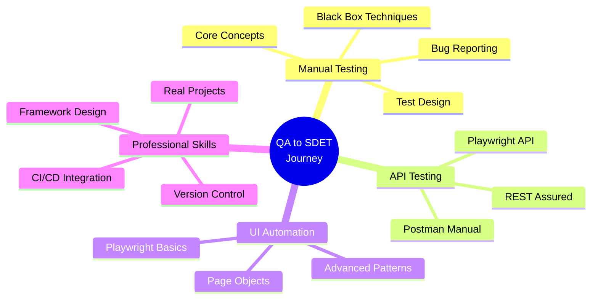
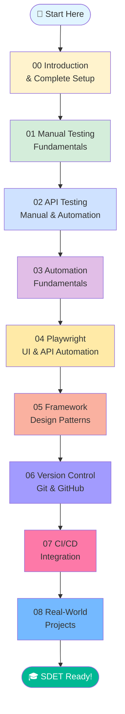
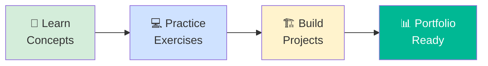

<div align="center">

# 🎓 Complete QA to SDET Roadmap

### Your Journey from Manual Testing to Test Automation Engineer


**A structured, hands-on learning path for Manual Testing, API Testing, and Playwright Automation**

---

**[🚀 Quick Start](#-quick-start)** • 
**[📚 Learning Path](#-learning-path)** • 
**[🛠️ Tools](#️-tools--technologies)** • 
**[💡 Why This Roadmap](#-why-this-roadmap)** • 
**[🤝 Contributing](#-contributing)**

---

</div>

## 🎯 Mission

> **"100% Free Education - Your Complete Journey from Manual Testing to Test Automation Engineer"**

This repository provides a comprehensive, structured learning path designed to transform you from a beginner in software testing to a proficient **Software Development Engineer in Test (SDET)**.

---

## 📖 Table of Contents

- [What You'll Learn](#-what-youll-learn)
- [Learning Path](#-learning-path)
- [Who Is This For](#-who-is-this-for)
- [Quick Start](#-quick-start)
- [Course Modules](#-course-modules)
- [Tools & Technologies](#️-tools--technologies)
- [Why This Roadmap](#-why-this-roadmap)
- [Prerequisites](#-prerequisites)
- [Best Practices](#-best-practices)
- [Contributing](#-contributing)
- [Support & Community](#-support--community)
- [License](#-license)

---

## 🌟 What You'll Learn



### Key Skills You'll Master:

✅ **Manual Testing Fundamentals** - Core testing concepts, methodologies, and best practices  
✅ **API Testing** - Manual testing with Postman, automation with REST Assured and Playwright  
✅ **Playwright Automation** - Modern web automation for UI and API testing  
✅ **Framework Design** - Build scalable, maintainable test automation frameworks  
✅ **Version Control** - Git and GitHub for collaborative development  
✅ **CI/CD Integration** - Automate test execution in deployment pipelines  
✅ **Real-World Projects** - Portfolio-ready automation projects  

---

## 🧭 Learning Path



### 📊 Estimated Timeline:

| Learning Pace | Weekly Hours | Total Duration |
|---------------|--------------|----------------|
| **Part-time** | 5-10 hours | 4-6 months |
| **Accelerated** | 15-20 hours | 2-3 months |
| **Full-time** | 30-40 hours | 1-1.5 months |

---

## 👥 Who Is This For?

This roadmap is perfect for:

| Profile | What You'll Gain |
|---------|------------------|
| 🌱 **Complete Beginners** | Start from zero, build strong testing foundation |
| 🔄 **Manual Testers** | Transition smoothly into test automation |
| 🎓 **QA Engineers** | Level up with modern automation frameworks |
| 💼 **Career Changers** | Complete learning path from basics to advanced |
| 🚀 **Aspiring SDETs** | Master skills for SDET roles in top companies |

---

## 🚀 Quick Start

### Get Started in 3 Steps:

```bash
# 1. Clone this repository
git clone https://github.com/ghanendra-sdet/qa-to-sdet-roadmap.git

# 2. Navigate to the project
cd qa-to-sdet-roadmap

# 3. Start with Module 0 (Introduction & Setup)
cd 0_introduction
cat README.md
```

### Your First Day Checklist:

- [ ] ⭐ Star this repository
- [ ] 🍴 Fork to your GitHub account
- [ ] 📖 Read Module 0: Introduction
- [ ] 🛠️ Set up development environment
- [ ] ✍️ Complete your first exercise

---

## 📚 Course Modules

### Module 0️⃣: Introduction & Setup
**Duration:** 1-2 days | **Level:** Beginner

- Repository overview and learning path
- Complete development environment setup
- All tools installation and configuration
- Getting started guide

📂 **[Start Here: Module 0 →](./0_introduction/)**

---

### Module 1️⃣: Manual Testing Fundamentals
**Duration:** 2-3 weeks | **Level:** Beginner

**Topics:**
- Core testing concepts and terminology
- Types of testing (functional, regression, smoke, sanity)
- Black box testing techniques (EP, BVA, Decision Tables, State Transition)
- Test levels (unit, integration, system, acceptance)
- Defect lifecycle and bug reporting
- Severity vs Priority

**Deliverables:**
- ✅ Test case documentation
- ✅ Bug report samples
- ✅ Exploratory testing notes

📂 **[Go to Module 1 →](./1_manual_testing/)**

---

### Module 2️⃣: API Testing (Manual & Automation)
**Duration:** 3-4 weeks | **Level:** Beginner to Intermediate

**Topics:**
- API fundamentals (REST, SOAP, GraphQL)
- Manual testing with Postman
- REST Assured automation
- Playwright API testing
- API test framework design

**Deliverables:**
- ✅ Postman collection with API tests
- ✅ REST Assured automation scripts
- ✅ Playwright API test suite

📂 **[Go to Module 2 →](./2_api_testing_manual/)**

---

### Module 3️⃣: Playwright Basics
**Duration:** 2 weeks | **Level:** Intermediate

**Topics:**
- Playwright setup and configuration
- Locator strategies
- Basic interactions and assertions
- Page Object Model introduction

**Deliverables:**
- ✅ Basic Playwright test suite
- ✅ Page Object classes
- ✅ Utility functions library

📂 **[Go to Module 3 →](./3_playwright_basics/)**

---

### Module 4️⃣: Playwright API Automation
**Duration:** 2 weeks | **Level:** Intermediate

**Topics:**
- API automation with Playwright
- Request/Response handling
- Data-driven API tests
- Combining UI and API tests

**Deliverables:**
- ✅ API automation with Playwright
- ✅ Hybrid UI + API test scenarios

📂 **[Go to Module 4 →](./4_playwright_api_automation/)**

---

### Module 5️⃣: Playwright UI Automation
**Duration:** 3 weeks | **Level:** Intermediate to Advanced

**Topics:**
- Advanced UI automation patterns
- Cross-browser testing
- Visual testing
- Performance testing basics

**Deliverables:**
- ✅ Complete UI automation suite
- ✅ Cross-browser test execution

📂 **[Go to Module 5 →](./5_playwright_ui_automation/)**

---

### Module 6️⃣: Framework Design
**Duration:** 3-4 weeks | **Level:** Advanced

**Topics:**
- Test framework architecture
- Design patterns in test automation
- Configuration and data management
- Reporting and logging

**Deliverables:**
- ✅ Custom test automation framework
- ✅ Framework documentation
- ✅ Reusable component library

📂 **[Go to Module 6 →](./6_framework_design_playwright/)**

---

### Module 7️⃣: Real-Time Projects
**Duration:** 4-6 weeks | **Level:** Advanced

**Topics:**
- E-commerce application automation
- Banking workflow automation
- SaaS platform testing
- Mobile-responsive testing

**Deliverables:**
- ✅ Portfolio-ready projects
- ✅ Complete test execution reports

📂 **[Go to Module 7 →](./7_real_time_projects/)**

---

### Module 8️⃣: Tools & Environment Setup
**Duration:** 1 week | **Level:** Beginner

**Topics:**
- Development tools installation
- IDE configuration
- Browser setup
- Testing tool installation

📂 **[Go to Module 8 →](./8_tools_and_environment_setup/)**

---

### Module 9️⃣: Git, GitHub & CI/CD
**Duration:** 2-3 weeks | **Level:** Intermediate to Advanced

**Topics:**
- Version control with Git
- GitHub workflows
- CI/CD with GitHub Actions
- Jenkins integration
- Docker for test environments

**Deliverables:**
- ✅ GitHub Actions workflows
- ✅ Jenkins CI/CD pipeline
- ✅ Dockerized test environment

📂 **[Go to Module 9 →](./9_git_github_and_ci_cd/)**

---

## 🛠️ Tools & Technologies

### Technology Stack:

| Category | Tools | Purpose |
|----------|-------|---------|
| **Programming** | JavaScript / TypeScript | Test scripting and automation |
| **Manual Testing** | Test case management tools | Documentation and tracking |
| **API Testing** | Postman, REST Assured, Newman | API testing and automation |
| **UI Automation** | Playwright | Web application automation |
| **Version Control** | Git, GitHub | Source code management |
| **CI/CD** | GitHub Actions, Jenkins | Continuous integration/deployment |
| **Containerization** | Docker | Test environment isolation |
| **Reporting** | Allure, Playwright Reporter | Test execution reporting |
| **IDE** | VS Code, WebStorm, IntelliJ | Code development |

> [!NOTE]
> All tools used are **free and open-source** or have free tiers suitable for learning.

---

## 💡 Why This Roadmap?

### 🎯 What Makes This Different:

1. **100% Free** - No hidden costs, all materials and tools are free
2. **Structured Learning** - Clear progression from basics to advanced
3. **Hands-On Focus** - Every module includes practical exercises
4. **Real-World Projects** - Build portfolio-ready automation projects
5. **Industry-Relevant** - Tools and frameworks used in top companies
6. **Beginner-Friendly** - No prior programming experience required
7. **Comprehensive** - Covers manual testing to advanced automation

### 🎓 Learning Approach:



---

## 🎓 Prerequisites

### For Manual Testing (Modules 0-1):
- ✅ No prior experience required
- ✅ Basic computer skills
- ✅ Willingness to learn

### For Automation (Modules 2+):
- ✅ Completed previous modules
- ✅ Basic JavaScript/TypeScript (we'll teach you!)
- ✅ Familiarity with command line

### Recommended (But Not Required):
- 📚 Basic HTML/CSS understanding
- 🌐 Experience with web browsers
- 💻 Any programming language basics

---

## 💡 Best Practices

### ✅ Do:
- ✔️ Practice consistently (30-60 min daily)
- ✔️ Write code alongside tutorials
- ✔️ Document your learning journey
- ✔️ Build projects for your portfolio
- ✔️ Push code to GitHub regularly
- ✔️ Join testing communities

### ❌ Don't:
- ✖️ Skip fundamentals (manual testing)
- ✖️ Rush through exercises
- ✖️ Copy-paste without understanding
- ✖️ Work in isolation
- ✖️ Aim for perfection over progress

---

## 🤝 Contributing

We welcome contributions! Here's how you can help:

1. 🍴 Fork this repository
2. 🌿 Create a feature branch
3. ✏️ Make your improvements
4. 📝 Commit with clear messages
5. 🚀 Submit a Pull Request

**Contribution Ideas:**
- 📖 Improve documentation
- 🧪 Add practice exercises
- 💡 Share real-world examples
- 🐛 Report and fix issues
- 🌍 Translate to other languages

---

## 💬 Support & Community

### Get Help:

- 📖 **Documentation:** Detailed README in each module
- 💬 **Discussions:** Use GitHub Discussions for questions
- 🐛 **Issues:** Report bugs via GitHub Issues

### Stay Connected:

- ⭐ **Star** this repository
- 👀 **Watch** for updates
- 🍴 **Fork** to create your version
- 📢 **Share** with aspiring testers

### Recommended Communities:

- [Ministry of Testing](https://www.ministryoftesting.com/)
- [Test Automation University](https://testautomationu.applitools.com/)
- [Playwright Discord](https://discord.com/invite/playwright)
- [r/softwaretesting](https://www.reddit.com/r/softwaretesting/)

---

## 📊 Success Metrics

Track your progress:

- ✅ Modules completed
- ✅ Exercises finished
- ✅ Projects built
- ✅ GitHub contributions
- ✅ Portfolio development

---

## 📄 License

This project is licensed under the MIT License - see the [LICENSE](LICENSE) file for details.

---

<div align="center">

## 🌟 Ready to Start Your SDET Journey?

**Your transformation from QA to SDET begins today!**

### 📚 **[Begin with Module 0: Introduction →](./0_introduction/)**

---

Made with ❤️ for aspiring QA Engineers and SDETs

**Happy Learning! 🚀**

*Last Updated: February 2026*

**[⬆ Back to Top](#-complete-qa-to-sdet-roadmap)**

</div>
